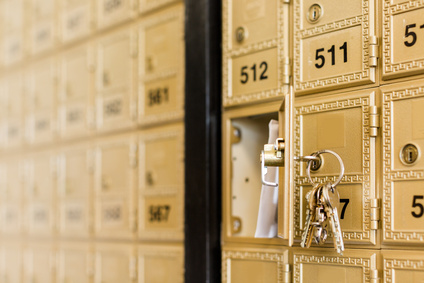

# Security between strangers

Because you have made already several attempts to send a confidential message between yourselves through a public channel, such as the FutureLearn chat window, I'm confident that you have been facing the same challenge that cryptographers were addressing for years until the late 1970's. That is, I know various strong ciphers and have tools available that can encrypt and decrypt messages given the correct key, but, how can I agree on a secret key with a total stranger?

Chances are the you were unable to agree with any of your colleagues on a secret key, unless you used a private communication channel, not the FutureLearn chat window. That's actually the limitation of *symmetric* cryptography, which relies on the fact that the two participants engaging in private communication know the same secret key. In this step we are going to look at a totally different approach, which has revolutionised the way we perform secure communication to the present day. 

## Asymmetric cryptography 

Whitfield Diffie and Martin Hellman won the 2015 Turing Award, considered the most prestigious award in the field of computer science, for introducing the idea of asymmetric public-key cryptography back in 1976. The concept of asymmetric cryptography has no trivial analogy to daily-life applications. But we will do our best to explain it first in an intuitive way and later give it in a more formal explanation. 
who published this concept in 1976. 

Imagine you have a lockable box with a groove, such as a mailbox. Only you have the key to lock an unlock such a box, so you make the box available for others to drop a message inside, again, same principle of mailboxes. People don't need to have a key to drop you a personal and confidential message. And because you and only you have the correct key, all messages within the box are secured from curious neighbours. 

<!--- (source: http://en.kryptotel.net/encryption.html) -->

Asymmetric cryptography works in a similar way to the example above. Instead of a single shared key, asymmetric cryptography relies on two keys. One is called *the public key* and the other one *the private key*. As the name suggests the private key is personal and should be kept secret, while the public key can be given to anyone. Messages encrypted with the public key can only be decrypted with the correct private key. Thus anyone, friends or foe, can send you an encrypted and confidential message by simply using your public key. This is remarkable feature! It is like being able to distribute as many mailboxes as we whish and to anyone.

Formally, an public-key (or asymmetric) cryptosystem consists of a key pair $(pk, sk)$ where $pk$ is a public key and $sk$ is a secret key, an encryption algorithm $enc$, and a decryption algorithm $dec$. The main functional requirement of a public-key cryptosystem is as follows: $dec(enc(m, pk), sk)$ where $m$ is a message. That is to say, any message $m$ encrypted with the public key can be decrypted with the corresponding private key. 

## Your task

A quick way to generate a pair of public and private key is by using PuttyGen: https://www.putty.org/. If you haven't done so already, try to generate a pair of RSA keys with PuttyGen. Those who already have used PuttyGen, please, comment why for. 