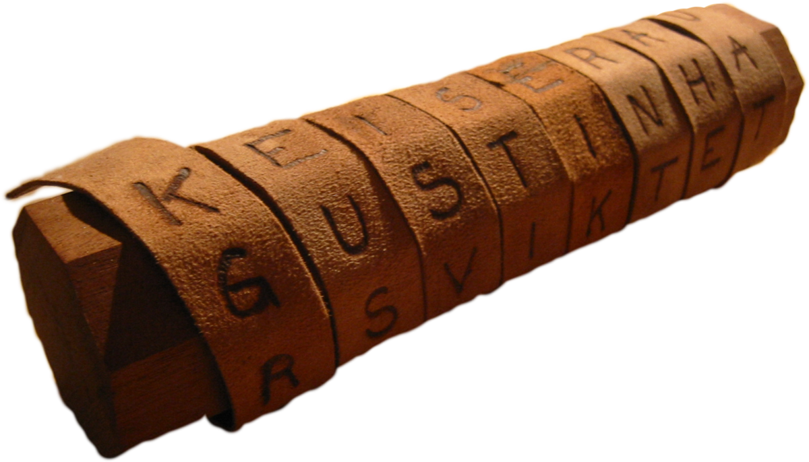

# Cryptography 

In the previous step we asked you to send a confidential message to another colleague through the FutureLearn chat windows. Chances are that you came up with an encryption algorithm to send a secret message. In this step we will briefly introduce cryptography, the most powerful mathematical tool ever used for confidential message exchange. 

## Ancient cryptography 

Humanity has developed extremely sophisticated communication languages in the form of symbols, words, and sounds, that together convey meaningful information. What is less obvious, is our ability to send information through public or insecure channels that only makes sense to a selected group of people. At the corporate and governmental level the ability to exchange confidential information gives an strategical advantage over the competition. At the individual level, people are interested on protecting their personal information against neighbors, jealous spouses, dictatorships, etc.

Hieroglyph is one the oldest language of symbols ever created. And this code was secret for everyone, but the Scribes. The scribes eventually disappeared, but the mystery of what have been written in those stones remained until the 19th century, when Jean-François Champollion deciphered the Rosetta hieroglyphs. 

Many secret languages of symbols have been created, and you probably have developed one yourself to communicate with a colleague at School. The problem is that a secret language can hardly remain secret for a long time and, at the same time, replacing it is time consuming or even unfeasible. 

The Spartans developed a clever trick to exchange confidential information written in standard Latin. Their idea was to wrap a long strip of leather to a rod with known diameter (see the figure below). A message is then written over strip while wrapped around the rod, and distributed unwrapped. The trick is that, without using a rod of the same diameter, the message is unreadable. 

<!--- (source: https://upload.wikimedia.org/wikipedia/commons/thumb/5/51/Skytale.png/1200px-Skytale.png) -->

The romans made the spartan technique more efficient by designing a substitution cipher whereby every letter in an original message is replaced by the letter that comes three positions later in the alphabet. The substitution is illustrated in the following below. For example, encrypting the text **futurelearn** results in **IXWXUHOHDUQ**. 

| a | b | c | d | e | f | g | h | i | j | k | l | m |n | o | p | q | r | s | t | u | v | w | x | y | z| 
|---|:---|:---|:---|:---|:---|:---|:---|:---|:---|:---|:---|:---|:---|:---|:---|:---|:---|:---|:---|:---|:---|:---|:---|:---|:---|:---|
| D | E | F | G | H | I | J |K | L | M | N | O |P | Q | R | S | T | U | V | W | X | Y | Z | A | B | C |

## Your task

Consider the following message encrypted by using the Caesar cipher: **FDHXDV**. Your task consists of decrypting that message and discuss how the Caesar cipher achieved its goal of conveying secret messages.  

## Further reading

https://en.wikipedia.org/wiki/Caesar_cipher
