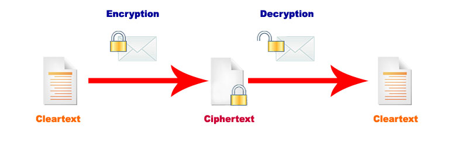

# Modern Cryptography 

To fully understand what we mean by an encryption and decryption algorithm we ought to relay on mathematics. Let $m$ be a message encoded in a binary alphabet $\{0, 1\}$, as the one used by current computers. Let $k$ be a text encoded in the same binary alphabet. An encryption algorithm is a function $enc(m, k)$ that, on input a message $m$ and a key $k$, gives an *encrypted message* $m'$. The corresponding decryption algorithm is defined in a similar way, as a function $dec(m, k)$ that, on input an encrypted message $m'$ and a key $k$, gives the *original message* $m$. We can make even more precise the intended property by requiring that $dec(enc(m, k), k) = m$, that is, a message $m$ encrypted with a key $k$ can be always decrypted by using the same key $k$.

A graphical representation of the encryption/decryption process is given below. 

<!--- (source: http://en.kryptotel.net/encryption.html) -->

In addition to the functional  requirement that encryption and decryption should be consistent when executed with the same key, cryptographic systems ought to provide a fundamental security guarantee: it shouldn't be possible to decrypt and encrypted message without knowing the correct key. As usual, we are going use mathematical notation to make these security requirement more precise. 

* Let $m$ be a plaintext message, $k$ a cryptographic key, and $m' = enc(m, k)$ the encryption of $m$ with the key $k$. Without knowing $k$, it must be unfeasable to obtain $m$. 

A cipher that does not satisfy the property above is said to be *broken*. 

## Your task. 

Your task is to find out whether the Caesar cipher satisfies the above security requirement. Justify your answer. 
