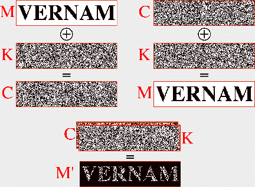

# Perfect secrecy

Strong encryption is expected to NOT leak meaningful information neither about the key nor the message. You probably already figured out in the last task that this is not the case for the Caesar cipher. Unfortunately, all cryptographic systems leak some information, with just one exemption: the *one-time pad*. 

## An anecdote

In 1982 David and Anne Martin discovered a message written in code within the remains of a carrier pigeon. The message read:

**AOAKN HVPKD FNFJW YIDDC RQXSR DJHFP GOVFN MIAPX PABUZ WYYNP
CMPNW HJRZH NLXKG MEMKK ONOIB AKEEQ WAOTA RBQRH DJOFM
TPZEH LKXGH RGGHT JRZCQ FNKTQ KLDTS FQIRW AOAKN**

In 2012, Bletchley Park, a member of the British Intelligence code breakers during World War II, said that the message could have been part of a top-secret program. Hence many, including top
government code breakers, took an interest on decrypting it. However, after months of cryptoanalysis with super-fast computers, a conclusion was reached: the code cannot be cracked. The reason? The message was encrypted 
using a one-time pad

## One-time-pad

With the industrial revolution, communications became automatic and the Vernam cipher (1926) was designed for secret communication. The Vernam cipher, also known as one-time pad, works as follows. 

* The message is a bitstring $m\in \{0, 1\}^n$, i.e. a binary sequence of length $n$
* The secret key $k$ is a **random** bit-sequence of length $n$, i.e. $k$ is randomly distributed over $\{0, 1\}^n$
* The encryption of $m$ with $k$ results in the encrypted text $m \oplus k$, where $\oplus$ is the exclusive disjunction (XOR) logical operator.  

The Vernam cipher has a nice visual representation by considering a white pixel to denote the bit $0$, while a black pixel denotes the bit $1$. The picture below shows an image with the text VERNAM and how it can be encrypted and decrypted by using a random image as the key. 

<!--- (source: http://crypto.cs.mcgill.ca/~crepeau/CS547/HW-3-03.html) -->

It was proven by Claude Shannon in $1949$ that one-time pad reveals absolutely nothing about the message or the key. But, one-time pad has a major drawback: a new key needs to be used for every encryption. That is to say, every time two parties want to exchange a secret message they would need to agree first on a fresh and random key of the same size than the message. This is not only inefficient, but often unfeasable in current computer systems. 

## Your task. 

Read about the Venona project and comment why the Soviet intelligence agency KGB failed on using the Vernam cipher correctly. 

