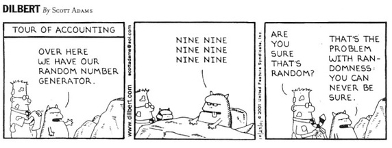

# A note on randomness

The Venona project shows that choosing *unpredictable* keys is of upmost importance in cryptography, where unpredictability means that the key can only be guessed with a very very low probability. Unpredictability in the selection of a key has two main components. 

1. The sample space where we choose keys from ought to be large. Case in point. The key in the Caesar cipher is a number $n$ between $1$ and $26$ (maximum number of letters in the Latin alphabet), representing the number of times each letter is shifted. This allows a simple attack whereby one can try out all possible 26 keys and check whether a meaningful message is decrypted. I encourage you to execute this attack on the encrypted messages sent by your colleagues in previous steps. 
2. The way we choose keys should lack a pattern, that is, our choice of a key within the space of keys should be random or close to random. Otherwise we risk that an adversary  guesses the chosen key with non-negligible probability and use it to decrypt our communication. Because true randomness cannot be obtained from current computer hardware, any software-based attempt to achieve randomness is called a pseudo-randomness. 

The importance of good randomness in cryptography can be further explained by considering game of chances, which rely on random choices as well. An interesting case occurred in 1994, Canada. A casino lost $600,000 CAD to Daniel Corriveau in Keno. He picked 19 of the 20 winning numbers three times in a row, a very unlikely and rare event. Corriveau claims he used a computer to discern a pattern in the sequence of numbers. However, a formal investigation later showed that the sequence was easy to predict because the casino was using an inadequate electronic pseudorandom number generator.

<!--- (source: https://cdn-images-1.medium.com/max/1600/1*Y2moeNdz1Gm5WFanlBo84A.png) -->

## Your task

Find famous attacks based on weak implementations of pseudo-random number generators and share your thoughts. 