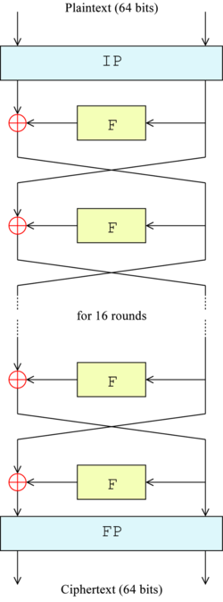

# Block ciphers

You may think that it is already time to see a "real-life" cipher, well, almost, but not quite yet. Allow me to list the four main questions you should be able to answer at the moment:

* What does an encryption and decryption algorithm is meant to do?
* When is an encryption/decryption algorithm said to be broken?
* Why is the length of the key important? 
* Why do keys need to be chosen randomly?

## DES

Assume you have a binary message $m$ of size $64$, i.e. $m \in \{0, 1\}^n$. If you are unsure how to convert standard characters in binary code take a look at the UTF-8 table below. Now, because you consider $m$ to convey sensitive information, you would like to encrypt it by using a cipher a lot more stronger than the Caesar cipher. That's exactly the task that the US standards body NBS (National Bureau of Standards) identified as a need back in 1973. 

<!--- (source: http://www.sciencefriday.com/wp-content/uploads/2015/08/UTF8-Table-7802.png) -->

After two years of submission and evaluation of different ciphers, a candidate proposed by IBM and known as DES was deemed acceptable. DES consists of a sequence of scramble operations, one after the other, such as permutation, XOR,and a peculiar F-function. We leave the details of the operations within DES to a crypto course. But we provide next a figure that depicts how a plaintext is transformed into a ciphertext by means of $16$ rounds of scramble operations. 

<!--- (source: https://upload.wikimedia.org/wikipedia/commons/thumb/6/6a/DES-main-network.png/250px-DES-main-network.png) -->

## The end of DES

DES was widely used for government and industry cryptography for more than two decades. However, in 1999 researchers broke DES by using the power of a  distributed computer system.

Why was DES broken? The simple answer is that the key length was *too* short. DES was designed with an effective key length of 56 bits, which is vulnerable to exhaustive search. Exhaustive search is what you did in a previous task by trying out *all possible* 26 keys that the Caesar cipher can use. In the case of DES, one can try out all $2^{56}$ possible keys. 

## Your task

In order to get a feeling on how expensive exhaustive search can be, I encourage you to write a small program in your favorite programming language that iterates from 1 to $2^{56}$. Because here we are not evaluating your ability to write computer programs, we provide an example of such a program in Java next. 

~~~ java
public static void main(String[] args) {
    
    for (int n = 1; n <= 56; n++) {
        System.out.println("Iterating from 2 to the power of "+(n-1)+" to 2 to the power of "+n);
        for (int i = (int)Math.pow(2, n-1); i < Math.pow(2, n); i++);
    }
}
~~~

It also has some weaknesses against differential and linear cryptanalysis: these allow to recover the key using, respectively, 247 chosen plaintexts, or 243 known plaintexts. A known plaintext is an encrypted block (an 8-byte block, for DES) for which the attacker knows the corresponding decrypted block. A chosen plaintext is a kind of known plaintext where the attacker gets to choose himself the decrypted block. In practical attack conditions, such huge amounts of known or chosen plaintexts cannot really be obtained, hence differential and linear cryptanalysis do not really impact the actual security of DES; the weakest point is the short key. Still, the existence of those attacks, which, from an academic point of view, have less complexity than the exhaustive key search (which uses 255 invocations on average), is perceived as a lack in security.

As a side note, differential analysis was known to the DES designers, and DES was hardened against it (hence the "good score" of 247). With today's standards, we would consider it as "not good enough" because it is now academic tradition to require attack complexity above exhaustive search. Still, the DES designers were really good. They did not know about linear cryptanalysis, which was discovered by Matsui in 1992, and linear cryptanalysis is more effective on DES than differential cryptanalysis, and yet is devilishly difficult to apply in practice (243 known plaintext blocks, that's 64 terabytes...).

The structural weaknesses of DES are thus its key size, and its short block size: with n-bit blocks, some encryption modes begin to have trouble when 2n/2 blocks are encrypted with the same key. For the 64-bit DES blocks, this occurs after encrypting 32 gigabytes worth of data, a big but not huge number (yesterday, I bought a harddisk which is thirty times bigger than that).

A variant on DES is called 3DES: that's, more or less, three DES instances in a row. This solves the key size issue: a 3DES key consists in 168 bits (nominally 192 bits, out of which 24 bits are supposed to serve as parity check, but are in practice wholly ignored), and exhaustive search on a 168-bit key is wholly out of reach of human technology. From (again) an academic point of view, there is an attack with cost 2112 on 3DES, which is not feasible either. Differential and linear cryptanalysis are defeated by 3DES (their complexity rises quite a bit with the number of rounds, and 3DES represents 48 rounds, vs 16 for the plain DES).

Yet 3DES still suffers from the block size issues of DES. Also, it is quite slow (DES was meant for hardware implementations, not software, and 3DES is even three times slower than DES).

Thus, AES was defined with the following requirements:

128-bit blocks (solves issues with CBC)
accepts keys of size 128, 192 and 256 bits (128 bits are enough to resist exhaustive key search; the two other sizes are mostly a way to comply to rigid US military regulations)
has no academic weakness worse than exhaustive key search
should be as fast as 3DES (AES turned out to be much faster than 3DES in software, typically 5 to 10 times faster)
The resistance of AES towards differential and linear cryptanalysis comes from a better "avalanche effect" (a bit flip at some point quickly propagates to the complete internal state) and specially crafted, bigger "S-boxes" (a S-box is a small lookup table used within the algorithm, and is an easy way to add non-linearity; in DES, S-boxes have 6-bit inputs and 4-bit outputs; in AES, S-boxes have 8-bit inputs and 8-bit outputs). The design of the AES benefited from 25 years of insights and research on DES. Also, the AES was chosen through an open competition with 15 candidates from as many research teams around the world, and the total amount of brain resources allocated to that process was tremendous. The original DES designers were genius, but one could say that the aggregate effort of cryptographers for the AES has been far greater.

On a philosophical point of view, we could say that what makes a cryptographic primitive secure is the amount of effort invested in its design. At least, that effort is what creates the perception of security: when I use a cryptosystem, I want it to be secure, but I also want to be certain that it is secure (I want to sleep at night). The public design and analysis process helps quite a lot in building that trust. NIST (the US body for standardization of such things) learned that lesson well, and decided to again choose an open competition for SHA-3.

## Key length 

The first key-recovery attacks on full AES were due to Andrey Bogdanov, Dmitry Khovratovich, and Christian Rechberger, and were published in 2011.[28] The attack is a biclique attack and is faster than brute force by a factor of about four. It requires 2126.2 operations to recover an AES-128 key. For AES-192 and AES-256, 2190.2 and 2254.6 operations are needed, respectively. This result has been further improved to 2126.0 for AES-128, 2189.9 for AES-192 and 2254.3 for AES-256,[29] which are the current best results in key recovery attack against AES.