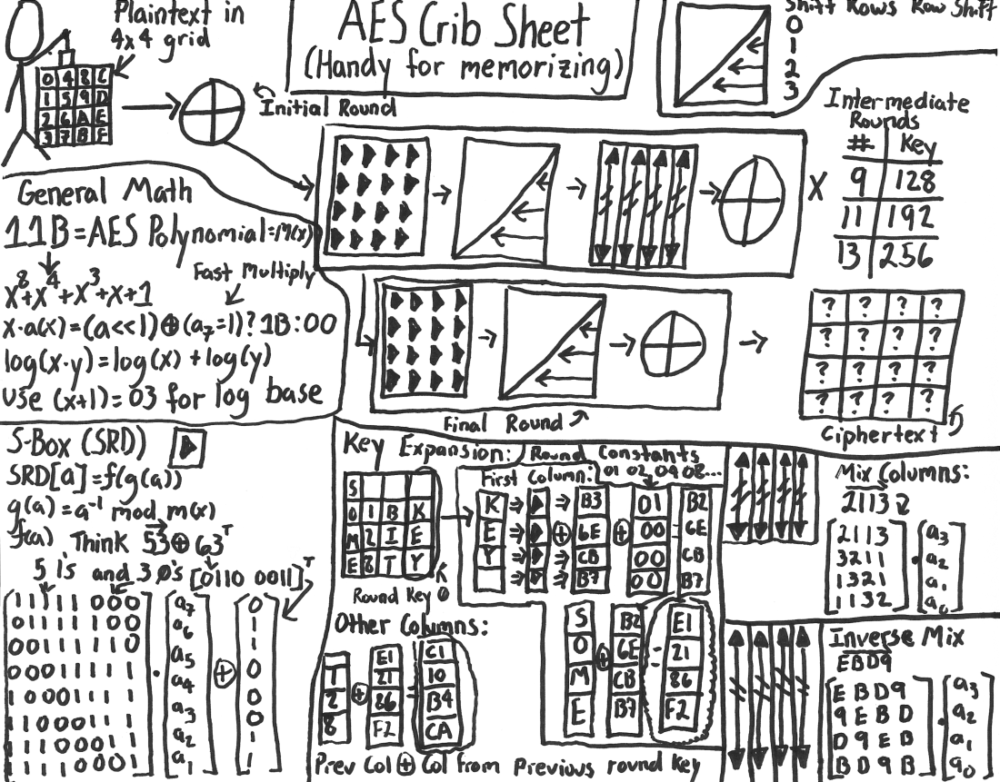

# AES

The insecurity of DES, mainly due to a short key size, led NIST (National Institute of Standards and Technology) to open a public competition for the successor to DES in January 1997.  The criteria used to evaluate a cipher  included not only cryptographic strength or unbreakability, but also ease of implementation and performance in software and hardware. The winner was *the Rijndael cipher*, designed by two Belgian cryptograhers Joan Daemen and Vincent Rijmen in October 2000. 

The Rijndael cipher was formally standarised in November 2001, taking the name of AES (Advanced Encryption Standard). AES is the symmetric cipher of choice for the majority of applications today. AES is even used for keeping secret classified information of the U.S. government.

## What does make AES stronger than DES? 

The short answer is a larger key size. AES accepts keys of size 128, 192 and 256 bits. Exhaustive search over a key space of size $2^{128}$ is already prohibitive expensive. Fifty supercomputers able to check a billion billion ($10^{18}$) AES keys per second would be capable of checking around $10^{27}$ keys per year. Therefore, it would require around $10^{12}$ years to exhaust the 128-bit AES key space. Whilst DES would be broken in $0.03$ seconds by the same computer configuration. 

AES benefited from 25 years of insights and research on DES. Thus its keys are not only larger, but the cipher itself is stronger to differential and linear cryptanalysis than DES. In a nutshell, cryptanalysis techniques look for clever tricks to break a crypto system without exploring the whole key space, and we encourage you to attend a crypto course to gain more knowledge on cryptoanalysis. 

For a graphical representation of the sort of scramble that occurs within AES, look at figure below. Again, cryptographic design and cryptoanalysis is a vast area in itself, so we kindly refer you to a course in cryptography for more details.

<!--- (source: https://upload.wikimedia.org/wikipedia/commons/c/cd/SubstitutionPermutationNetwork2.png) -->
 
## A note on block ciphers

Ciphers like DES and AES are called *block* ciphers because they encrypt the data in blocks or chunks. DES, for example, uses blocks of 64 bits, whilst AES uses 128 bit blocks. This means that, prior encryption, the message needs to be partitioned in blocks of a given size. Other type of ciphers can encrypt information symbol by symbol, such as the Caesar cipher. The latter type of cipher are known by *stream ciphers*. 

## Your task

In this task you will be allowed to play with the popular tool *cryptool*. You can download this tool from https://www.cryptool.org/en/ and get a quick tutorial at https://www.youtube.com/watch?v=giP7-ruVFEY.

Now, I'm going to give you a key and you will use it to send your name, as usual through the FutureLearn chat window, encrypted in AES-128. I encourage you to decrypt messages sent by your colleagues and comment whether you managed to do so successfully. 

They key is the following: 4e 65 74 77 6f 72 6b 20 53 65 63 75 72 69 74 79

Finally, you may notice that the key is given in Hexadecimal. But I can assure you that it is not random key, but a conversion of a few words to Hexadecimal. Can you spot what are the words hidden behind such Hexadecimal representation?