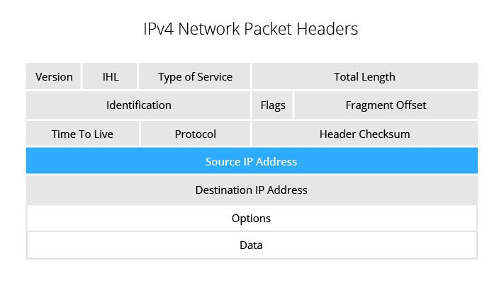
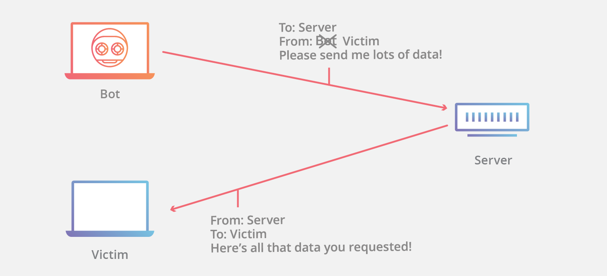

# IP spoofing

???
Hi Chris, Could you please paraphrase this page? 
Thank you. 
Vikrant   
???

IP spoofing is the creation of Internet Protocol (IP)
packets with a false source IP address, for the purpose
of hiding the identity of the sender or impersonating
another computing system. IP spoofing includes modifying the source IP address, a checksum and the order value in the packet header.

<!--- (source: https://www.incapsula.com/ddos/ip-spoofing.html) -->

The Internet is a packet switched network and every packet which leaves from one computer will travel through various computers and reach the destination in different order. A receiver machine resembles the message based on the order value as per the packet header information. IP spoofing aims to hijack computer sessions through denial-of-service attacks, which aim to overwhelm the victim with the unexpected traffic.

<!--- (source: https://www.cloudflare.com/learning/ddos/glossary/ip-spoofing/) -->

## Variation of IP spoofing:

* Non-blind spoofing: In this type of attack, the attacker is on the same subnet as a victim. The sequence and acknowledgement numbers can be sniffed which can lead to session hijacking. This can be achieved by corrupting the currently established session. then re-establish it based on the correct sequence and acknowledgement numbers with the attack machine.

* Blind spoofing: In this type of attack, the attacker is on the different subnet as a victim. So, sequence and acknowledgement number are unreachable. In order to attack, several packets are sent to the target machine in order to sample sequence numbers. Operating systems use a random sequence number which decreases the probability to attack the victim.  

* Man In the Middle Attack: In this attack, the attacker intercepts a legitimate communication between two friendly parties. The attacker then controls the communication and can eliminate or alter the information sent by one of the original participants without the knowledge of either the original sender or the recipient.

* Denial of Service Attack: In this attack, the attacker wants to flood the packets to the victim by modifying the source IP address information. Attackers target is to consume victim's bandwidth and resources. When multiple compromised hosts are participating in the attack, it is very hard to stop the attack.

## How to stop IP spoofing:

* Filtering the packets at the router: Implementing ACL (Access Control List) which blocks internal IP address on the downstream interface.

* Encryption and Authentication: In Ipv6, encryption and authentication are included which reduces the risk of spoofing.

### Your task
Investigate IP spoofing mitigation techniques. What is Ingress filtering? How can we configure it on the edge routers?