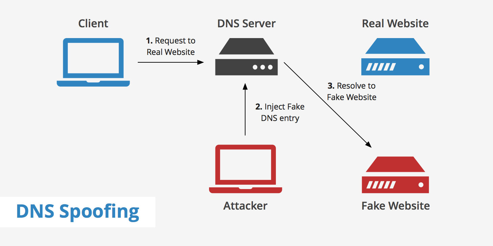

# DNS spoofing

## How DNS works

<!--- (source: https://www.keycdn.com/support/dns-spoofing/) -->

To send a message to another host, a source node need to put an IP address of the destination host in the packet. Mostly, user types a host name instead of the IP address as a destination address such as deakin.edu.au.
Unfortunately, host names are only nicknames. A computer need to find a way to associate host name to the IP address. In order to achieve this, a computer sends DNS request message to the DNS server which includes hostname of the target machine. DNS response message sends target's IP address. If we compare DNS with the telephone directory, human names in the telelphone directory represents host names and phone numbers represents IP address.

## How DNS can be spoofed?

<!--- (source: https://www.keycdn.com/support/dns-spoofing/) -->
DNS is critical in the internet's hostname to IP address resolution process. Unfortunately, if an attacker replaces an IP address of a host name with another IP address, DNS cache can be poisoned. After cache poisoning, a legitimate user wants to connect to a host name and contact DNS, will be redirected to the false IP address(Attacker's IP address). That way, user will be redirected to the attacker's chosen website.

## DNS servers hierarchy
DNS servers are organized in a hierarchy. If original DNS server does not know the IP address of the host name, it will forward the DNS request to the top level DNS servers such as DNS root servers. There are 13 DNS root servers such as .com, .edu, .IE, .UK, .NL and .CA. Each top level domain administrators maintains several top-level DNS servers for its domain. Second level domain names given to the organizations such as lenovo.com and microsoft.com. Each second level domain name servers need to manage one or more DNS servers who knows the host names of all connected computers within its domain.
Overall all different DNS servers are connected in a hierarchy. So if attacker bring down 13 top level root servers, then it can paralayze the whole internet.

### Your task
Investigate the attempts to strengthen DNS security and its effectiveness. What is DNSSEC? Do you have any suggestion(s) to improve the way DNS system works?