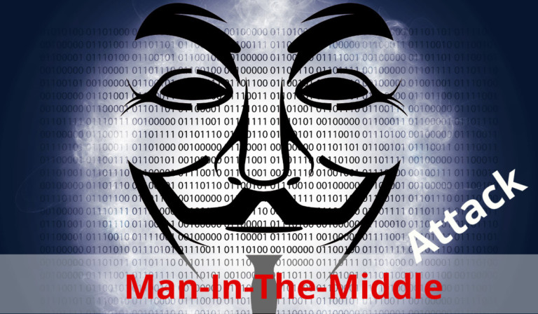

# Man-in-the-Middle attack(MitM)

Man-in-The-Middle attack is a common type of cyber security attack which can do following:
* Allows attacker to eavesdrop the communication between two targets.
* Allows attacker to block the communication between two targets.
* Allows attacker to modify the communication between two targets.

## Two types of MitM

* Passive MitM : Only listening to the communication and not modifying it.

* Active MitM : Listening and modifying the communication.

<!--- (source: 
https://secureswissdata.com/man-in-the-middle-attack-email/ ) -->

<!--- (source: 
https://www.thesslstore.com/blog/man-in-the-middle-attack/ ) -->

## How to mitigate MitM attacks

* Strong encryption on access points
* Use of Virtual private network
* Force HTTPS
* 

### Your task

Could you outline the case study across a few steps, pointing out the relevant principles as you go?
