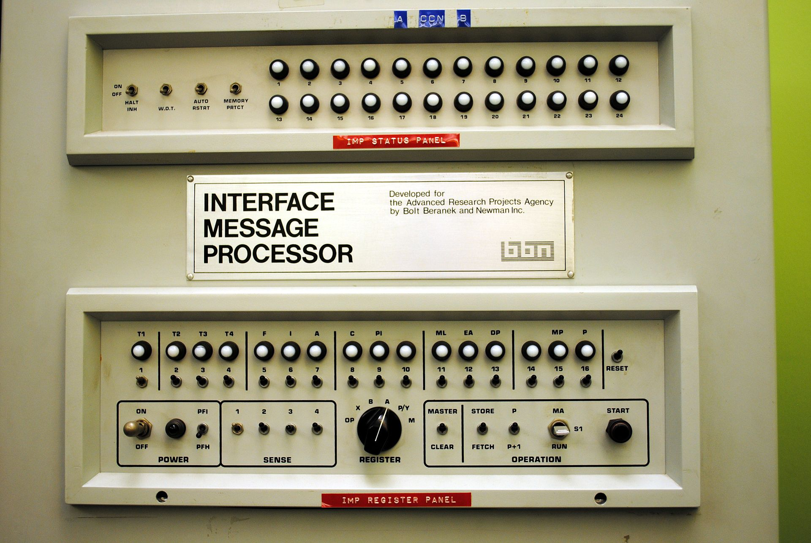
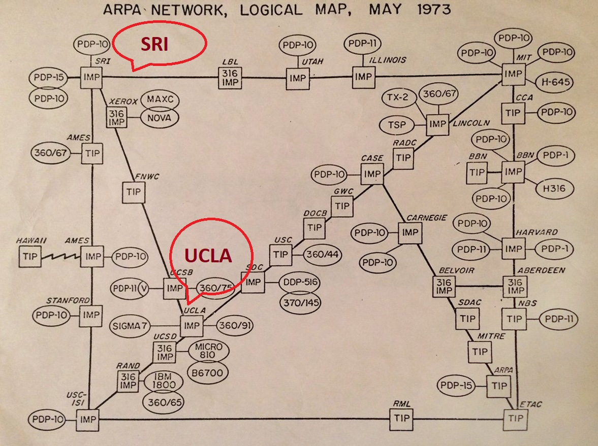
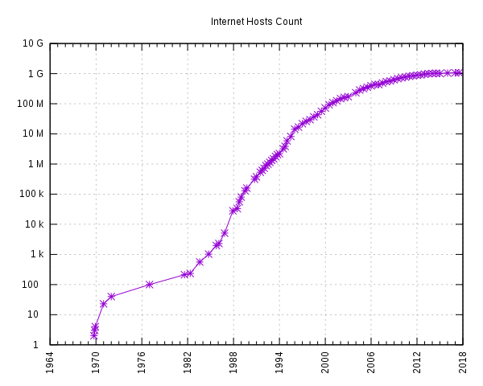
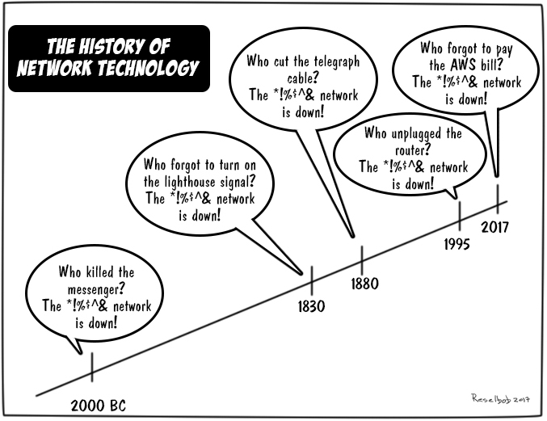

# What was the intention of connecting multiple computing devices? What they missed and included when they commenced the journey of forming the internet from a single computer.

* **1950s**: Development of electronic computers started. 

* **1960s**: Development of [ARPANET](https://en.wikipedia.org/wiki/ARPANET) (Advanced Research Projects Agency Network) project started. Objective of ARPANET project is to develop a network technologies and topologies that provide maximal reliability even in case of node and circuit failure. Packet switching was the only solution to this which made ARPANET a first packet-switching network ever. In 1967, Donald Davis demonstrated the first packet switching at the National Physical Laboratory (NPL), UK. There is no hesitation to say that ARPANET is the predecessor of the internet.

Network was formed using [IMPs](https://en.wikipedia.org/wiki/Interface_Message_Processor#BBN_Report_1822) (Interface Message Processor)(today's so called [router](https://en.wikipedia.org/wiki/Router_(computing))   ) and TIPs(Terminal Interface Processor). TIPs enabled individual computer terminals to connect directly to the ARPANET.

Figure below displays how ancient router looked like. 

<!--- (source: 
https://en.wikipedia.org/wiki/Interface_Message_Processor#/media/File:Interface_Message_Processor_Front_Panel.jpg ) -->

Figure below represents how computers were connected in the ARPA network in 1973. You will be surprised to know that the distacne between UCLA and SRI was 643kms.  

<!--- (source: 
https://en.wikipedia.org/wiki/ARPANET#/media/File:Arpanet_1974.svg

By Yngvar - Own work, based on notes and recollections from 1974, Public Domain, https://commons.wikimedia.org/w/index.php?curid=1555388) -->

In 1969, the first message was sent over the ARPANET from the University of California, Los Angeles (UCLA) to Stanford Research Institute (SRI). 

        At the UCLA end, they typed in the 'l' and asked SRI if they received it; 'got the l' came the voice reply. UCLA typed in the 'o', asked if they got it, and received 'got the o'. UCLA then typed in the 'g' and the darned system CRASHED! Quite a beginning. On the second attempt, it worked fine! 
        - [Leonard Kleinrock](https://www.lk.cs.ucla.edu/index.html), developer of packet switching 

* **1970s**: Era of various [packet switching networks](https://en.wikipedia.org/wiki/Packet_switching) such as NPL network, ARPANET, Tymnet, Merit Network, CYCLADES and Telenet. ARPANET project led to the need of the development of the protocols(set of rules and regulations) which resulted into the discovery of the first ARPANET host-to-host protocol, called Network Control Protocol(NCP).

In 1972, first time ARPANET was introduced to the general public with its first application called electronic mail (e-mail). This was the first time researchers needed to think about securing the communication over the ARPANET.
Name of the original ARPANET changed from ARPA Internet to the Federal Research Internet to TCP/IP Internet and finally to its current name known as Internet.

Idea of Internet was to connect multiple independent networks such as packet satellite networks and packet radio networks. Due to this new demand, existing NCP protocol seemed insufficient. 

In early 1970s, they publicly announced a protocol for internetworking and named as Transmission Control Protocol (TCP). This version of TCP was simple and only worked fine for file transfer and remote terminal access. It could not correct packet losses for voice transmission over packet switched network. To fix this they divided a TCP into two parts:
        1) IP (Internet Protocol)
        2) a new TCP (Transmission Control Protocol)

and they have added UDP protocol for real time communication services such as voice transmission which acts as a alternative fast approach to TCP. Overall, we have seen that how TCP as a one layer got converted into two layers during the early age of the Internet. So far, there was no need of securing the network as their main target was to fix the data transmission.

 * **1980s**: In 1986, NSF funded several universities to develop national supercomputing centres and provided interconnectivity with NSFNET (National Science Foundation Networks) project. Commercial ISPs (Internet Service Providers) started participating in the late 1980s. Now, the Internet is mainly funded by private companies referred as a Internet Service Providers (ISPs) who provide local internet connectivity to their clients. 
 
 In addition, Tim Berners-Lee invented World Wide Web (WWW) which links hypertext document to the Information systems in such a way that it can be accessible from anywhere in the world. Now, this is a revolutionary change in the Internet which demanded a need of securing communication over the Internet.

* **1990s**: Increased use of electronic mail, the World Wide Web and the invention of instant messaging, VoIP telephone calls, video calls has resulted in the unbelievable growth of the internet we have witnessed from 1990s to now. In addition, fiber optic technology has supported the rapid growth in form of two-way data transfer rate over the internet.

<!--- (source: 
https://en.wikipedia.org/wiki/Global_Internet_usage#/media/File:Internet_Hosts_Count_log.svg) -->

It's been almost 70 years now since the journey of the Internet (Packet switching to TCP/IP protocol suite to Internet) started. With the rapid growth of the Internet, objective of the Internet has also shifted from increasing bandwidth to improving communication quality to improving communication security now a days.

<!--- (source: 
https://www.networkcomputing.com/files/history-networkingjpg) -->

It is worth to think what would be the scenario of the Internet after 70 years from now. Do you feel safe while using the Internet where your computer is connected to all other somehow? Do you think your data on the local computer or communication over the phone is secure? 

If everyone on the road follow the rules there will be no accidents. Similarly, if every one follow the rules over the internet, there will be no need to secure the Internet.
However, everyone is different as a human being some way or other. If someone break rules on the road, they get a fine as we have the speed cameras to identify the fault. Similarly, protocols plays the vital role of cameras to mitigate the fraud over the internet.

It is always easier to find out one bad guy out of 10, it may take few hours to do this. What if I tell you to identify a bad guy out of 1 million or billion?

## Our concern in this unit

This unit focuses on various cybersecurity attacks which affect communication protocols running on a computer network. Although this may seem like a narrow focus at first glance, we will see throughout this unit that man-in-the-middle attacks have driven the development of the majority of network protocols we use nowadays. That being said, we'd encourage you to learn about every type of cyber attack you are likely to face.

### Your task

When did you first have access to a computer network?  How have computer networks evolved since then?
