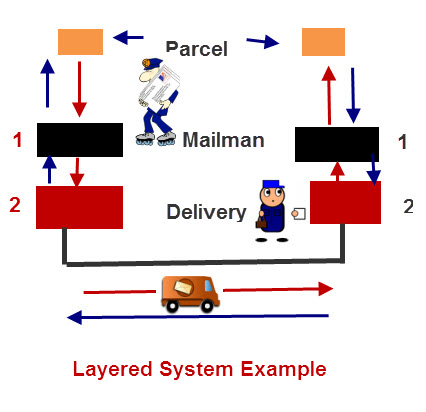

# How a message travels over the Internet using a Network Architecture

Now we know how the Internet was formed and How important protocols are? Let's see, how the Internet works, means how a message travels from one computer to another over the Internet.

### What is Protocol?
A protocol is a set of rules that decide how systems communicate. For networking, they decide how data is transferred from one computer to another.

### What is a Protocol Suite?
A protocol suite is a collection of protocols that are designed to work together. TCP/IP is an example of a protocol suite.

### Protocol Stacks
As we discussed earlier, to keep the roads safer, we all need to follow same traffic rules. The same way we all need to use the same protocols while we communicate over the Internet. 

We can write a protocol that takes a data from one computer application and sends it to an application on another computer which is known as a single stack protocol. In this example, we are using a single protocol to satisfy the whole functionality of the application. This approach is not flexible in case any change require, we will need to change the entire application and protocol software.

## Layered Protocol Stack

As a solution, researchers have divided the whole problem of communication into smaller pieces, which are easier to solve. Each layer in the network architecture targets smaller piece of the problem. That is the main reason why we have layers in the network architecture. As a bonus, it gives you more flexibility, because you can change a layer without affecting the other layers. Each layer is associated to set of protocols which can be changed as per the requirement of the application.
Each layer of the stack performs a particular function and communicates with the levels above and below it.

# Update the example (Ref: http://www.steves-internet-guide.com/internet-protocol-suite-explained/)

Let's take an example of parcel service to understand it. 

The task is to send a parcel from one office to another office. 

We will divide the task into two separate processes as follow:

1. Take a package, wrap it, address it.
2. Send it to the destination.

at the receiving end

1. Receive the package
2. Deliver it to the recipient

Typically you would have an internal mail man that:

1. Collects the parcels from the senders and takes them to a mail dispatch room.
2. The parcels are placed in a van by the dispatcher and then driven to the remote office.

At the remote office

1. The parcels are received by the dispatcher and placed into a tray for the mail man
2. The mail man collects the parcels and delivers them to the recipients,

The diagram below shows the process:

<!--- (source: http://www.steves-internet-guide.com/internet-protocol-suite-explained/) -->

### From above example, can you guess what would be the advantage of splitting the task into different layers/tasks?
Well. Any of the layers/tasks can be changed without affecting the other layers. 

So if for example, if we decide to use a train instead of a van to transport the messages between the offices we could do so without affecting the mail man.

In fact, the mail man doesn’t know and doesn’t care, how the parcels are transported between the offices, as all he does is collect them, and pass them to the delivery man.

A network is divided into different functional components called layers. We will discuss the two main layer models: OSI and TCP.

## OSI network model
The Open Systems Interconnection model (OSI model) is a theoretical model that embodies and regulates the communication functions of a computing system without respect to its underlying interior structure and technology. Its goal is to ensure the interoperability of various communication systems with standard protocols. There are several layers in the OSI network model. Each layer serves the layer above it and is served by the layer below it.

Let's take a look at it in a little bit more detail:

<!--- (source: http://rismanabila20.blogspot.com.au/2016/09/) -->

* **Layer 1 - Physical Layer**: It represents connectors, wiring and specifications on how voltage and bits pass over cable or on wireless mediums.

* **Layer 2 - Data Link Layer**: This layer is responsible for linking data between nodes.  It is responsible for error control and flows control services.

* **Layer 3 - Network Layer**: The network layer is the one that defines how interconnected networks function. It takes a data from the transport layer and wraps it inside a packet or datagram.  We're going to be looking at the network layer in detail during the course.

* **Layer 4 - Transport Layer**: It is responsible for reliable message transfer and communication between programs or processes. Port or socket numbers are used to identify these unique processes. TCP is an example of Transport Layer protocol. Examples of transport layer protocols are TCP, UDP, SCTP, DCCP etc.

* **Layer 5 - Session Layer**: It controls the connections/sessions between computers. Examples of session layer protocols are NetBIOS and RPC (Remote Procedure Call).

* **Layer 6 - Presentation Layer**: The presentation layer transforms data into the form that the application accepts. It also does encryption and compression. Examples of presentation layer protocols are MIME, SSL, TLS, XDR etc.

* **Layer 7 - Application Layer**: The application layer is the OSI layer closest to the end user, which means both the OSI application layer and the user interact directly with the software application. Example of Application layer protocols are FTP, SNMP, SMTP and Telnet.

We covered what each layer does in the OSI model. Now we will see how each layer practically gets represented by a network device to do their job.

## Layers and associated devices
Network devices are designed in such a way that they function as a specific layer. Here is the list of network devices and their associated layers.  
* **Layer 3** - **Network Layer** - **Router, Layer 3 switch**
* **Layer 2** - **Data Link Layer** - **Bridge, Switch**
* **Layer 1** - **Physical Layer** - **Hub, Repeaters**

Figure below shows how network devices connect different layers between two hosts. For examples, Router connects network layers of two hosts. If we want to connect two hosts using data link layer, then we can use the bridge. Repeater work as a physical layer connectivity. 

<!--- (source: 
https://www.automation.com/library/articles-white-papers/industrial-ethernet/introduction-to-switch-technology) -->

## TCP/IP protocol suite

It is commonly known as TCP/IP because the foundational protocols in the suite are the Transmission Control Protocol (TCP) and the Internet Protocol (IP). It consists of four main layers such as Data Link Layer, Network Layer, Transport Layer and Application Layer.
The figure below represents TCP/IP protocol stack.

<!--- (source: 
https://en.wikipedia.org/wiki/Internet_protocol_suite#/media/File:IP_stack_connections.svg -->

Let's take a very simple example to give you an overview of how these layers might work together to deliver a message.

### Layers in application

As per the network topology is shown in the figure above, Let's assume Host A is in Melbourne and Host B is in Sydney. Both hosts are connected to their respective router(Host a to a Router A and Host B to the Router B). Let's assume that both routers are connected via a satellite network. Host A wants to send a message to Host B.

The flow of the message will be as per the numbers are shown in the figure(1 to 17). We will see what happens at each step:

step 1: Host A generates a message at the application layer and sends it to the transport layer.

Step 2: At the transport layer, TCP protocol assigns some more information(like sequence number, source port number, destination port number etc) to the data coming from upper layer so that the communication remains reliable i.e, a track of sent data and received data could be maintained. After adding this information to the packet it forwards it to the network layer.

Step 3: Here, IP adds its own information over the data coming from the transport layer. This information would help in packet travelling over the network. 

Step 4: The data link layer of Host A makes sure that the data transfer to/from the physical media is done properly. Here again, the communication done at the data link layer can be reliable or unreliable.

Step 5: Using physical medium packets will travel to the data link layer of the router A.

Step 6: As we know that router is a layer 3 device. That means router has a physical layer, data link layer and a network layer. Data link layer of router A will forward the packets to the network layer of Router A.

Step 7: Here, packets will find out where to travel over the internet based on the IP address information received from the routing table stored at the network layer of Router A. [Routing table](https://en.wikipedia.org/wiki/Routing_table) is the list of entries which maps network address entries to the routes. It will say to packets, go to the satellite network route if you want to travel to the Router B. From Router A's network layer packets will travel to the Router A's data link layer.

Step 8: The data link layer of Router A makes sure that the data transfer from the physical media to the satellite network is done properly. 

Step 9: Data will travel according to the route suggested by routing table entries at Router A.

Step 10: Router B's data link layer will receive the packets and forward it to the network layer of Router B.

Step 11: Router B's routing table entries will tell packets where is Host B in the network. So packets will start travelling towards Host B via data link layer of the Router B.

Step 12: Router B's data link layer sends packets to the physical layer of Router B which is the physical cable.

Step 13: Using physical medium packets will travel to the data link layer of the Host B.

Step 14: Data link layer will forward packets to network layer at Host B.

Step 15: Network layer of Host B forwards packets to Transport layer of Host B.

Step 16: At the transport layer, all packet will get rearranged and sent to the Application layer of Host B.

Step 17: Application layer will process the packets and display it in the application at Host B. 

Next time you send a message to your friend using any application either from your phone or computer, just repeat these steps to understand how a message travels over the Internet to your friends running application on his phone or computer.

### Your task
After exploring OSI network model and TCP/IP protocol suite,
Investigate other existing protocol suits and read about them.