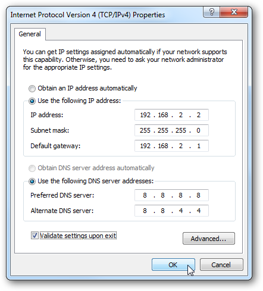
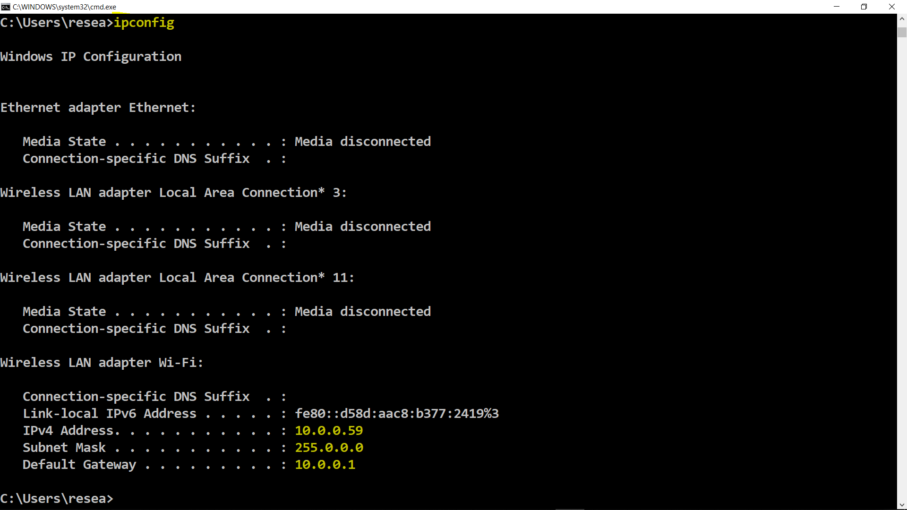

## Now that you have an overview of computer network architectures, we're going to take a closer look at communications protocols on the network layer.  The internet protocol (IP) is the single most common of all.

The Internet Protocol (IP) determines where data should be sent to and retrived from.  It is essentially the web's addressing framework. It gives an IP address to every machine on the internet which can be used to distinguish it from every other machine.  The protocol also standardises the way machines distribute packets of data.  The routing process is the same whether the machine is a PC, printer, phone or anything else.

### How the IP and TCP fit together - Vikrant?

### IP address

The original version of IP (known as IPv4) forms addresses which consist of four pairs of digits such as 62.45.65.85 or 244.156.123.45. The rapid growth of internet generated high demand for unique IP addresses. In January 2011, all possible combinations of IP addresses were used up.  A new IP system was introduced called IPv6 with a greater number of possible combinations of unique IP addresses.  

IPv4 is a 32-bit and IPv6 is a 128-bit number for each host on a network. For routing efficiency, the IP address is divided into two parts:

* the prefix, which is used for identification of a network and thus known as a network address 
* the suffix, which is used as identification of a host machine for a particular network thus known as a host address. 

Of course, for this to work a unique prefix is required for each network on the internet.  

<!--- (source: 
http://www.elkor.net/articles/static_ip/ )-->

If you want to see the current IP configuration using command prompt, then open command prompt by pressing 'windows key + R', type 'cmd' and press enter. Once command prompt is open, type 'ipconfig' then press enter.

<!--- (source: Manually created image by Vikrant Patel) -->

### Netmasks
Netmasks represents which part of the IP address is a network ID and which part is Host ID.  They vary by [IP class](https://en.wikipedia.org/wiki/Classful_network). For class A, netmask is always 255.0.0.0. For class B, netmask is 255.255.0.0.

### IP Routing

IP packets travel from one router to another until they reach its destination using a routing table to figure out where to send it next. When IP receives a packet from higher-level protocols such as TCP or UDP, it finds the closest possible routing path towards the destination IP address from its routing table entries. The most specific to least specific route in the routing table is listed in order below:

* A route that matches the destination IP address directly (Host route).
* A route that matches the network ID of the destination IP address (Network route).
* The default route.

### DNS
When we talk about website addressing, we normally refer them using terms that most people would find simple to understand, like www.websitenameexample.com, rather than using their actual IP addresses. However, all the website data is stored at one of the host machines on the internet and accessing the website means contacting the particular host machine. Because of the DNS (Domain Name System), we are able to translate the website name into the IP address and that is the reason we are able to access website data using our browsers.  The DNS is often compared to an address book, which maps domain names to IP addresses.

### DHCP  
In the network, DHCP (Dynamic Host Configuration Protocol) is responsible for assigning the IP addresses to each computer.

### Putting it all together - Vikrant or Rolando to write

Explain how each of the elements described in this step work together to form a network.  'Paul wants to visit the Professor's website.'

### Your task 

Have you spotted any weaknesses in the internet protocol?  How do you think its vulnerabilities might be exposed by hackers?

(Reason I have changed this task: 1) I didn't fully understand what they were being asked to do 2) To answer it would require a lot more reading 3) If the answer is important, surely the information they need to figure out the answer should be given to them in the step.)

### Further reading
[Understanding TCP/IP addressing and subnet basics](https://support.microsoft.com/en-au/help/164015/understanding-tcp-ip-addressing-and-subnetting-basics)
