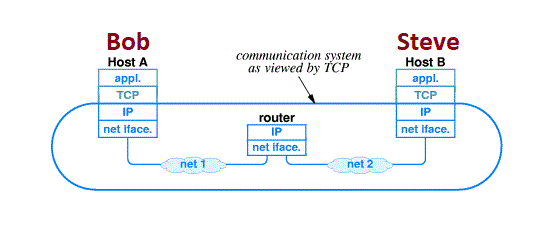
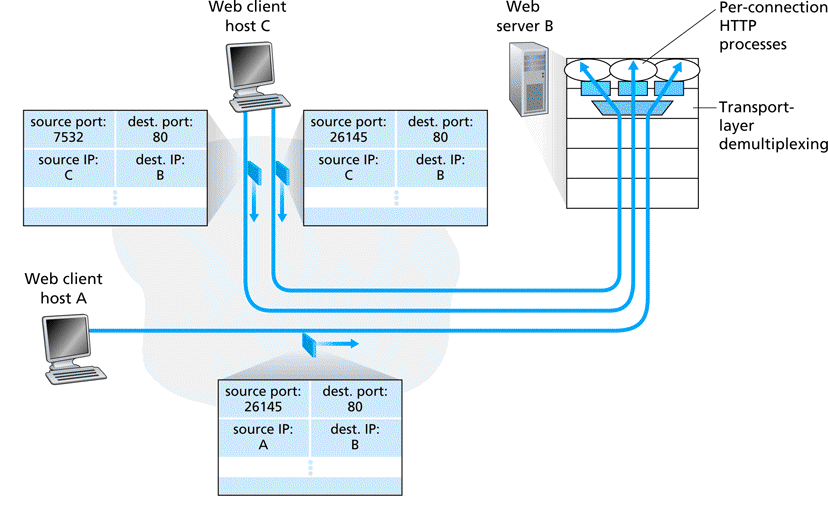
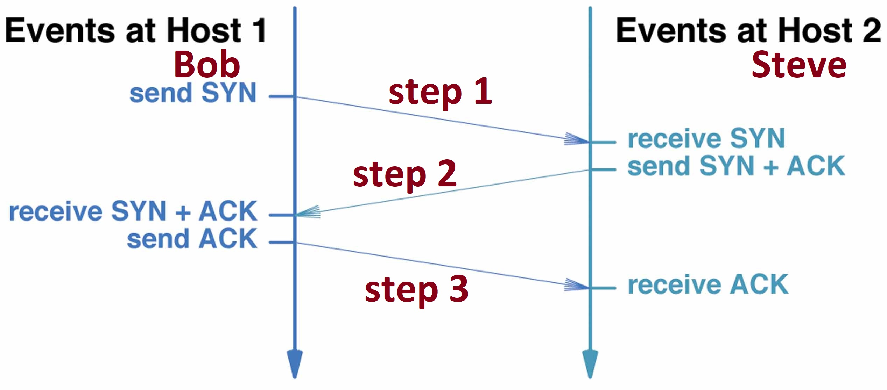
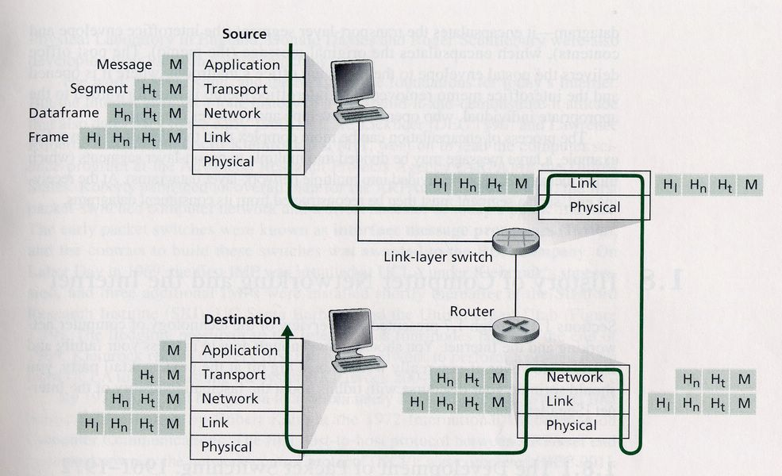

## TCP is the most widely used transport layer protocol

???
Hi Chris, Could you please paraphrase this page? Thank you. Vikrant   ???

The other part of the control system, Transmission Control Protocol (TCP), sorts out how packets of data move back and forth between one computer (in other words, one IP address) and another. It's TCP that figures out how to get the data from the source to the destination, arranging for it to be broken into packets, transmitted, resent if they get lost, and reassembled into the correct order at the other end. Without TCP, IP cannot guarantee the successful communication over the internet. Means if we don't use TCP with IP, we can not expect the reliable delivery of the packets over the network. TCP takes the charge of making the connection reliable.

<!--- (source: 
http://www.dcs.bbk.ac.uk/~ptw/teaching/IWT/transport-layer/internet.gif)-->

The figure above shows how TCP views a communication system in form of layers when it connects two hosts between different networks.

### Characteristics of TCP

* Connection-oriented: every application request for a connection. Once established, use it for the data transfer.

* Reliability: TCP gives a guarantee that sent data will be delivered in the same format without any duplication or damage. 

    If the packet gets lost, TCP fixes it using retransmission of the lost packet. For reliability, TCP sends an acknowledgement back to the sender upon receiving the data. A time is started when data starts travelling, if the timer expires before the acknowledgement arrives, Source retransmits the data. 

* Point-to-point communication: Each TCP connection has exactly 2 endpoints. 

<!--- (source: 
http://www.dcs.bbk.ac.uk/~ptw/teaching/IWT/transport-layer/two-clients-web-server.gif)-->

From above figure, we can see that TCP creates two separate TCP connections for two different HTTP processes. Only difference between both connections is that it uses the different port number.

* Reliable startup: Sender and receive agrees using connection establishment process before data gets transmitted.

* Full-duplex connection: Data flows in both the direction of each connection.

### TCP connection/Socket

A TCP connection is done with a 3-way handshake between a client and a server. The following is a simplified explanation of this process.
* The client asks for a connection by sending a TCP segment with the SYN control bit set.
* The server responds with its own SYN segment that includes identifying information that was sent by the client in the initial SYN segment.
* The client acknowledges the server’s SYN segment. 

<!--- (source: 
http://www.dcs.bbk.ac.uk/~ptw/teaching/IWT/transport-layer/notes.html)-->

The connection is then established and is uniquely identified by a 4-tuple called a socket or socket pair: (destination IP address, destination port number) (source IP address, source port number) During the connection setup phase, these values are entered in a table and saved for the duration of the connection.

### ICMP
Internet Control Message Protocol is a set of messages that communicate errors and other conditions that require attention. ICMP messages, delivered in IP datagrams, are usually acted on by either IP, TCP or UDP. Some ICMP messages are returned to application protocols. A common use of ICMP is “pinging” a host. The Ping command (Packet INternet Groper) is a utility that determines whether a specific IP address is accessible. It sends an ICMP (type 8 code 0 message) echo request and waits for an Eco reply (type 0 code 0 message). Ping can be used to transmit a series of packets to measure average round-trip times and packet loss percentages.

### How data travels from source to destination on the Internet

The Internet is a combination of different networks connected to each other. The connection between different networks is formed by router and switches. 

<!--- (source: http://edume.myds.me/60_2004_1700_pliroforiki_ke_diktion/1002_computers_ke_diktia/1091/01_18.jpg )-->

The figure above shows how data actually travels from source to destination via switches and routers.

### Your task
Execute commands from the ICMP protocol, such as ping and traceroutes.
