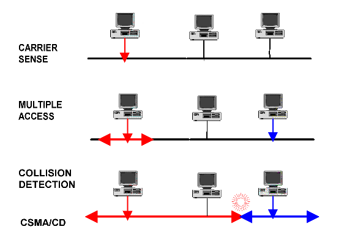

# Network Sniffing

Let's recap on the main points that we've explored so far this week.

Computer networks are made up of several layers.  

While it's important to know, in overview, how the layers function together, communications between clients and servers happen on the network layer.  It is, therefore, this layer that we'll focus on this layer during a course on communications network security.  

Most interactions between a client and a server on this layer occur using IP/TCP.  The IP identifies _where_ to send packets of data to and from, using IP addresses.  The TCP handles the transfer of this data by ensuring a reliable connection between the client and the server.

### Compromising networks

This system is good, but it's not perfect.  

Ulimately, no matter what their motivation, every hacker is trying to compromise and gain access to a target system.  Before the hacker can do this, they need know a fair bit about their target systems and the tools they can use to find the system's vulnerability.  We can use these same tools to audit our own system's vulnerabilities and help to make them more secure.  That way, if we know our system's vulnerabilities, we have chances to fix them before someone exploits them.

Many current computer networks are vulnerable to sniffer tools.  Let's take a look at some of the flaws that make network sniffing an easy task.

### CSMA/CD

Before we discuss the packet sniffing tools, we need to understand the function of data link layer (and, in particular, the Ethernet). There are often many devices attached to the same [network segment](http://www.linfo.org/network_segment.html). What happens if all the devices try to send a message at the same time on the shared segment?  Often, you may end up with a data collision, where packets of data collide with one-another, resulting in useless garbled messages.

<!--- (source: http://pharoah-net.blogspot.com.au/2011/12/logical-topology.html -->

Let's take an example to understand how this works more clearly. 

When I was a child in school, I knew two identical twin boys who were always placed into different classes.  Ocassionally, they would play a prank by switching places.  Especially as they grew older and a little more sophisticated, it would sometimes take quite a while for the teachers to figure out there waas a child in their class who shouldn't be there.

Now, imagine we are in such a classroom with 30 students, when the teacher asks a question.  If all 30 students start speaking at the same time, would it be possible for a teacher to listen to an answer clearly? Obviously, no. Why? Because of a collision between every student's voice signals which are travelling in the same classroom. What would be the solution? Before speaking, every student should if someone else is speaking at the same time. If so, the student will wait for a while and try again later. If not, the student will start speaking instantly. The CMSA/CD works in exactly the same way.

### What is sniffing?

Why does this matter in a course on network security?  As you have probably already figured out, sometimes someone is in the classroom who's not meant to be there.

Similarly, the CMSA/CD means that multiple devices are using the same physical cable while sending, receiving and listening in to the data.  If you wanted to sense (or 'sniff') each and every packet travelling around the same network segment, this would be a simple task.  I'd simply need to go to the data link layer and install Wireshark or any other packet sniffer.

The process of capturing network traffic and inspecting it closely to determine what is happening on the network is called Network Analysis. 

<!--- (source: https://i0.wp.com/latesthackingnews.com/wp-content/uploads/2017/08/Packet-sniffing.jpg?resize=728%2C445&ssl=1
 -->

A network analysis tool displays network traffic to a user. This process goes by many names, including packet, traffic or protocol analysis and eavesdropping.  However, the most popular term for it is sniffing.  Network analyser tools can be a combination of either hardwore and software, or jsut software.  They vary in the number of protocols they can decode, the quality of the decoding, user interface and statistical graphing capabilities.

### How is sniffing achieved?

Unfortunately, if you know what you're doing, sniffing is not too difficult to achieve.  An attacker simply needs to put themselves somewhere in communication's path on the target network.  

There are many ways to achieve this.  The most obvious is simply to snaff data from the physical cable.  Others include breaking into a target computer or an ISP, installing sniffing software and controlling it remotely.  Sometimes ISPs already have sniffing systems in place which can, themselves, be hacked.  Finally, they can divert all communications through a path that includes the intruder's computer.

Just like the twin brothers who were already at the same school, each of these methods are easiest to achieve if you're already part of an organisation's network.

### The risks of sniffing

Sniffing can present a major risk to the security of your information.  An experienced and well resourced 'man in the middle' can use sniffing to compromise information on your system, capture usernames and passwords, capture and replay usernames and passwords, map a network or for [passive OS fingerprinting](http://www.netresec.com/?page=Blog&month=2011-11&post=Passive-OS-Fingerprinting).

### Your task
There are a number of common network analyzer tools that can be used for sniffing.  Investigate two or three of them and compare and contrast them. 
