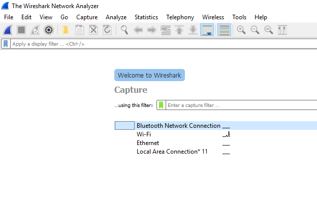
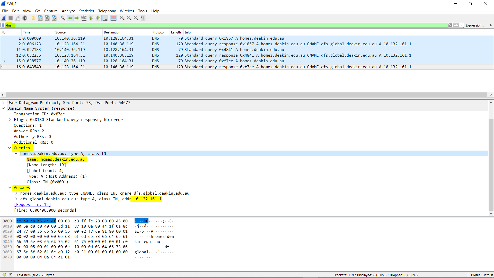
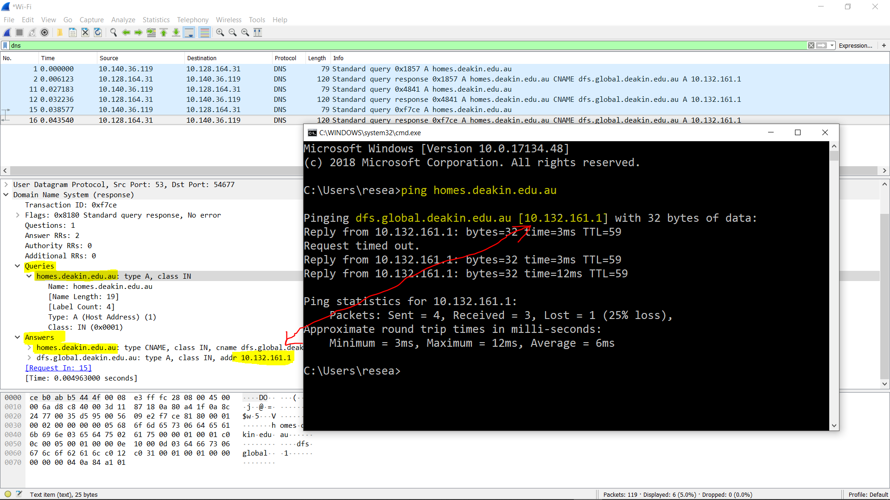

# Sniffing in action

In this step, we'll show you how to use Wireshark to capture real time packets of information.

Wiershark is one of the best known tools for network analysis.  It's used regularly for a number of different purposes.  It is probably used most frequently by network administrators to troubleshoot a network but is often used by engineeers to verify network applications and developers for debugging.

In this case, you're going to use it to learn a little bit more about the insides of a network protocol.

You will need to [download and install Wireshark](https://www.wireshark.org/download.html) follow along with this step.

## Capturing Packets
When we launch the Wireshark, it asks us to select the name of the network interface to start capturing packets. Select whichever best applies to you.

<!--- (source: Manually created image by Vikrant Patel) -->

As soon as we select the network interface, it starts detecting the packets in real time.

<!--- (source: Manually created image by Vikrant Patel) -->

Wireshark will capture each packet sent to or from your system. Click on the red button near the top left corner of the Wireshark window when you want to stop capturing packets. There are options available to configure colour coding for each protocol. For examples, you could set ICMP protocol to red, if you'd like.

<!--- (source: Manually created image by Vikrant Patel) -->

You can select any packet entry to see the details.

<!--- (source: Manually created image by Vikrant Patel) -->

Filtering functionality allows you to filter the packets using the same protocols. In snapshot above, we've filtered the DNS protocol. Upon selecting any DNS packet, it displays its query and the answer. The snapshot displays that the DNS query was generated for homes.deakin.edu.au and in response, the IP address was returned.

<!--- (source: Manually created image by Vikrant Patel) -->

In above snapshot, we have verified the IP address of homes.deakin.edu.au host using the ping command.

Packet details can be analysed for TCP and HTTP protocols which provide important details about the communication.  You can rebuilt an entire layer 7 protocol session by rightclicking on a TCP packet and selecting _follow TCP stream_.  **VIKRANT** Two sentences on what a layer 7 protocl session is, and why you would want to find out about it.

Wireshark is an extremely powerful tool. Network professionals and security professionals use it widely during their day to day practice.

### Your task
Use Wireshark to sniff on your network. How might you use it to secure your networks, and what are its limitations?
