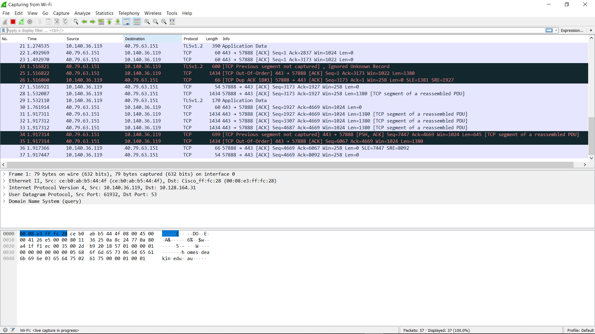
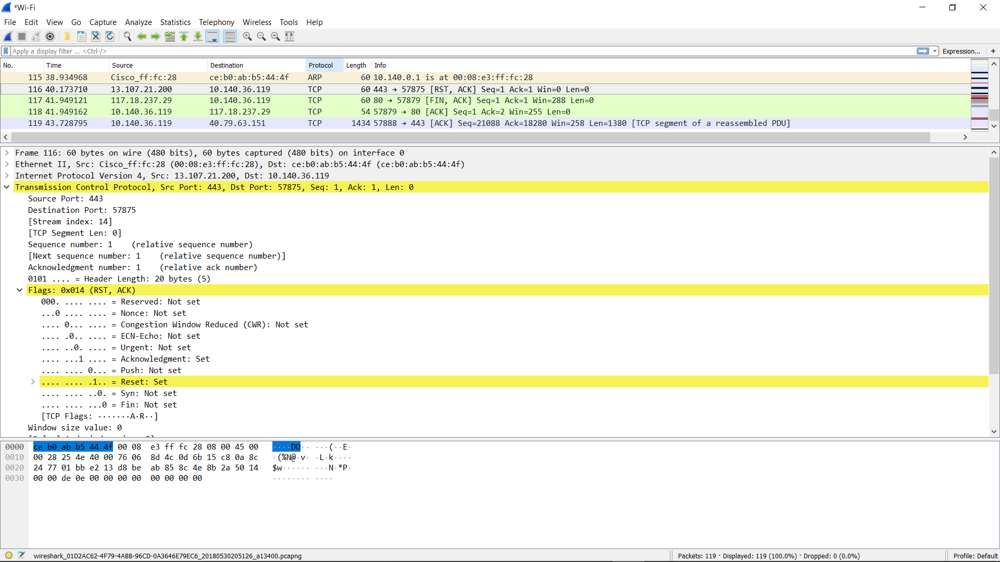

# Wireshark - Protocol analyzer
Wireshark (Previously known as Ethereal) is one of the best known tool for network analysis. It can capture the packets real time and display them in human-readable format. This topic will cover the brief tutorial of wireshark.

## Who need Wireshark
* Network administrator to troubleshoot the network
* QA engineers to verify network applications
* Developers use it to debug protocol implementations
* Students use it to learn network protocol internals

## Capturing Packets
When we launch the Wireshark, it asks us to select the name of the network interface to start capturing the packets on that interface. You can select any options according to your scenario.

<!--- (source: Manually created image by Vikrant Patel) -->

As soon as we select the network interface name, it start sensing the packets in real time.

<!--- (source: Manually created image by Vikrant Patel) -->

 It capture each packet sent to or from your system. Click on the red button near the top left corner of the wireshark window when you want to stop capturing packets. There are options available to configure color coding for each protocol. For examples, if you want to set ICMP protocol to red color(for monitoring), you can do that. 

<!--- (source: Manually created image by Vikrant Patel) -->
You can select any packet entry to see the details for the selected packet.

<!--- (source: Manually created image by Vikrant Patel) -->

Filtering functionality allows you to filter the packets with the same protocols. In above snapshot, DNS protocol is filtered. Upon selecting any DNS packet, it displays its query and the answer. Above snapshot displays that the DNS query was generated for homes.deakin.edu.au and in response IP address was returned.

<!--- (source: Manually created image by Vikrant Patel) -->

In above snapshot, we have verified the IP address of homes.deakin.edu.au host using ping command.

Packet details can be analysed for TCP and HTTP protocols which provide important details about the communication. It allows us to right click on a TCP packet and choose "Follow TCP stream" to rebuild an entire Layer 7 protocol session. 

Wireshark is extremely powerful tool. Network professionals and security professionals use it widely during their day to day practice.

### Your task
Use Wireshark to sniff on your network. Why tools like Wireshark are there? How can we draw pakcet analyzer tool's limitations? Sniff packets using Ettercap packet analyzer.