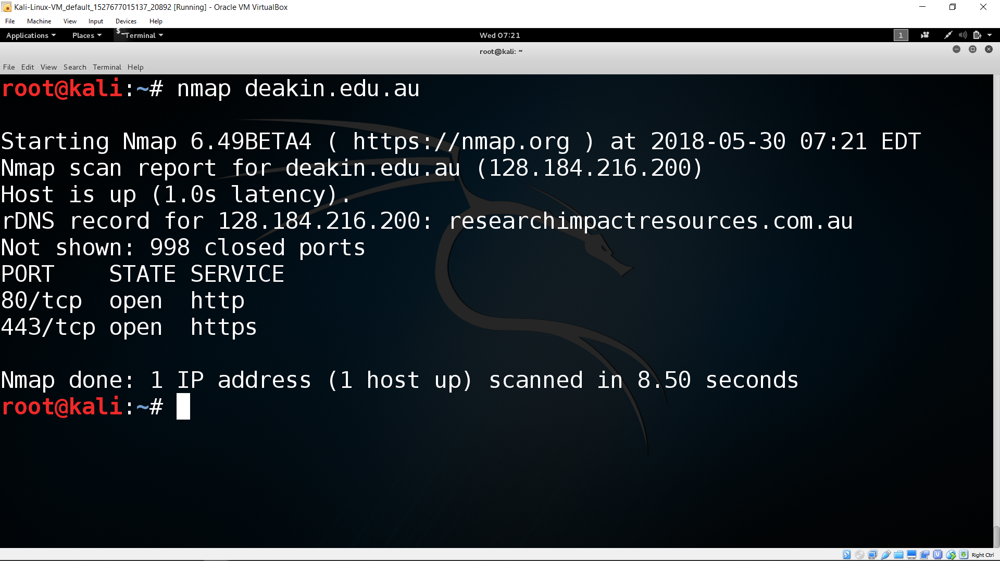
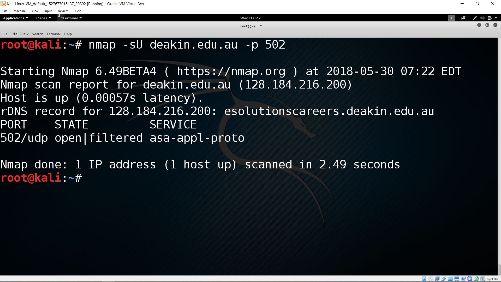
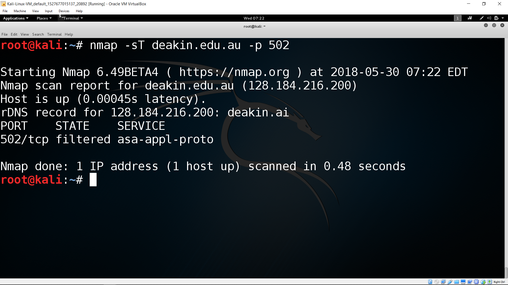

# Port scanning

Port scanning allows hackers to probe for vulnerabilities in a system.

Once an attacker knows the IP address of live hosts, they can use port scanning to find out what applications (including security applications) that the hosts are running.  This lets your attacker make further decisions about how to compromise your network.  

Applications are associated with port numbers. For example, HTTP uses the port number 80.  If port 80 is open, then the computer is probably likely to be a web server.  Port numbers range between 0 and 1023 and each number indicates a certain application. This allows the attacker to identify which applications are running on the host, using a scanning probe.  In the background, the port identification process sends a connection to a program on a particular port number. If a program responds to the agreement, then it means that particular port is open on the host.

Public IP addresses are controlled by worldwide registrars. However, port numbers are not controlled by anyone. Port numbers are 16 bits unsigned integer and these are unique for each computer.  Some are well known, otheres are registered, by many are dynamic and/or private.

* Well known ports (0 - 1023)
* Registered ports (1024 - 49151)
* Dynamic/private ports (49512 - 65535)

### Examples of well known port numbers:

* echo – 7 - TCP
* ftp-data – 20 - UDP
* ftp – 21 - TCP
* ssh – 22 - TCP
* telnet – 23 - TCP
* domain – 53 - UDP
* www-http – 80 - TCP

# Nmap - A Stealth Port Scanner

Ever wondered how attackers find out which ports are open on a computer/host? Or how they discover which services are running on a computer without asking network admininstration.  To do so, they' use a handy tool called a Netwrok Mapper (NMap).

<!--- (source: Manually created image by Vikrant Patel) -->

Nmap is the ideal tool for performing a simple network inventory or vulnerability assessment. By default, Nmap performs an SYN scan and can quickly scan thousands of open, closed and filtered ports.

## Syntax of Nmap scan

    nmap -s[Scan Type(s)] [Options] {target specifications}

**Scan Types:**

* T - this is the connect scan with the host. It uses 3-way handshake with the target system and thus offer reliable results. However, as its 3-way handshake is logged by the system, it is least stealthy. 

* S - this option is reliable for scanning as it does not complete 3-way handshaking. It just sends a packet with SYN flag to 1 to open a connection.

* U - unlikely T and S scans, U provides a scan for UDP ports.

* A - this scan sets ACK to 1 which shows ongoing TCP communication. It can be used to create confusion and pass through the firewalls.

**Target specifications:**
* IP address - Here we have to provide either single IP address or range of IP address.

## Nmap Examples

Let's apply -T option to find out port 502 (it represent Modbus - one of the protocol) 

* kali > nmap -sT deakin.edu.au -p 502

As we can see, nmap found port 502 filtered on this system. That means the port is enabled but has a firewall blocking access. 

Sometimes UDP scan reveals more information. Let's try nmap UDP scan against host deakin.edu.au. For UDP scans, the option is -U.

* kali > nmap -sU deakin.edu.au -p 502

<!--- (source: Manually created image by Vikrant Patel) -->

<!--- (source: Manually created image by Vikrant Patel) -->
From the above result, we can see that port 502 is either open or filtered.

* To find out what you can do using nmap, 'go to terminal > type nmap > press enter'.

### Your task
Investigate association of port scanning with TCP/IP protocol stack. Which layer in TCP/IP protocol stack is associated with ports? Use Kali operating system and play with the preinstalled tool Nmap: https://github.com/nmap/nmap. Try **man nmap** command and see what it display.
