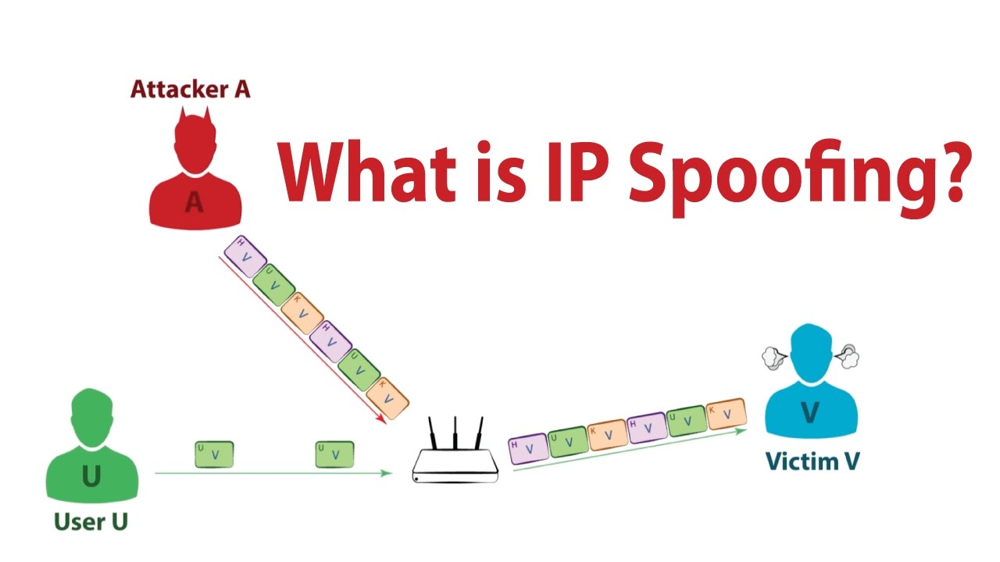

# Spoofing

THe next type of systems attack you should keep watch for is spoofing.

Most of you have probably gotten a scam phone call.  Scammers protect themselves by ensuring that we can't identify the caller's number, and they work because they only thing we have to verify they are who they are is their voice.  

In exactly the same way, scammers can try to 'call' us via an IP address.  Any IP address in a network is, therefore, untrustworthy unless we have some way of authenticating it.

Caller ID spoofing allows an attacker to modify or change displayed number on the screen. Mainly this is possible on VoIP networks which allows attacker to present false name and numbers. 

A spoofing attack occurs when an attacker impersonates another device or user on a network in order to launch attacks against network hosts, steal data or spread malware to bypass access controls.

## Reason behind Spoofing

Spoofing can only be successful because of flaws in protocol's and application's verification functions.  Many TCP/IP protocols do not check sender and receiver messages, and many applications don't follow any verification processes whatsoever.  This allows just about anyone to connect to the application.

<!--- (https://www.google.com.au/url?sa=i&source=imgres&cd=&cad=rja&uact=8&ved=2ahUKEwjUlN6c8LLbAhXGipQKHQ4CDrEQjRx6BAgBEAU&url=https%3A%2F%2Fwww.youtube.com%2Fwatch%3Fv%3DrxN4zWTNSds&psig=AOvVaw2MOdnw46Uxma076CadfvpR&ust=1527956649375221

https://www.caida.org/projects/spoofer/
) -->

## Types of spoofing attacks:
* IP address spoofing
* ARP spoofing
* DNS spoofing

### How to mitigate Spoofing

* Verification of sender and receiver's identity.
* Deep packet inspection at the firewall.

Next, we will go through each spoofing attacks in details.

### Your task
Investigate the difference between Sniffing and Spoofing.
