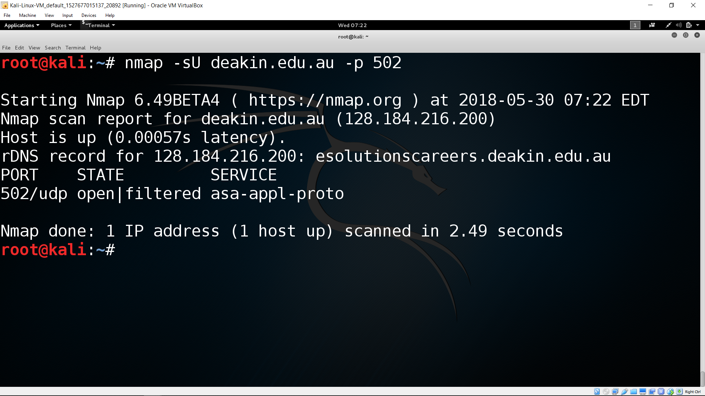

# Port scanning

Once attacker knows the IP address of the live hosts, next step is to find out what applications hosts are running. By knowing running applications and its vulnerabilities, it is easier for an attacker to take further decisions. On server, Applications are associated to port numbers. For example, HTTP uses port number 80. If port number 80 is open, that means computer could be the web server. There are port number range between 0 to 1023 and each number indicates certain application. Attacker sends a port scanning probes to each identified host in order to determine which applications are running on that host. In the background, port identification process sends an connection to a program on a particular port number. If program responds with the agreement, then it means that particular port is open on the host.

Public IP addresses are controlled by worldwide registrars. however port numbers are not controlled by anyone. Port numbers are 16 bits unsigned integer and unique for each compouter.

* Well known ports (0 - 1023)
* Registered ports (1024 - 49151)
* Dynamic/private ports (49512 - 65535)

### Example of well known port numbers:
* echo – 7 - TCP
* ftp-data – 20 - UDP
* ftp – 21 - TCP
* ssh – 22 - TCP
* telnet – 23 - TCP
* domain – 53 - UDP
* www-http – 80 - TCP

# Nmap - A Stealth Port Scanner

Ever thought how attackers can find out which ports are open on a computer/host? or how to find out which services are running on a computer without asking to network admin? Well. It is possible by using this handy tool called Nmap (Network Mapper).

<!--- (source: Manually created image by Vikrant Patel) -->

Nmap is the ideal tool for performing a simple network inventory or vulnerability assessment. By default, Nmap performs a SYN scan and can be quickly scan thousands of open, closed and filtered ports.

## Syntax of Nmap scan

    nmap -s[Scan Type(s)] [Options] {target specifications}

**Scan Types:**

* T - this is the connect scan with the host. It use 3-way handshake with the target system and thus offer reliable results. However, as its 3-way handshake is logged by system, it is least stealthy. 

* S - this options is reliable for scanning as it does not complete 3-way handshaking. It just sends a packet with SYN flag to 1 to open a connection.

* U - unlikely T and S scans, U provides scan for UDP ports.

* A - this scan sets ACK to 1 which shows ongoing TCP communication. It can be used to create confusion and pass through the firewalls.

**Target specifications:**
* IP address - Here we have to provide either single IP address or range of IP address.

## Nmap Examples

Lets apply -T option to find out port 502 (it represent modbus - one of the protocol) 

* kali > nmap -sT deakin.edu.au -p 502

<!--- (source: Manually created image by Vikrant Patel) -->

As we can see, nmap found port 502 filtered on this system. That means port is enabled, but has a firewall blocking access. 

Sometimes UDP scan reveal more information. Lets try nmap UDP scan against host deakin.edu.au. For UDP scans, the option is -U.

* kali > nmap -sU deakin.edu.au -p 502

<!--- (source: Manually created image by Vikrant Patel) -->

From the above result, we can see that port 502 is either open or filtered.

* To find out what you can do using nmap, 'go to terminal > type nmap > press enter'.

### Your task
Investigate association of port scanning with TCP/IP protocol stack. Which layer in TCP/IP protocol stack is associated to ports? Use Kali operating system and play with the preinstalled tool Nmap: https://github.com/nmap/nmap. Try **man nmap** command and see what it display.
