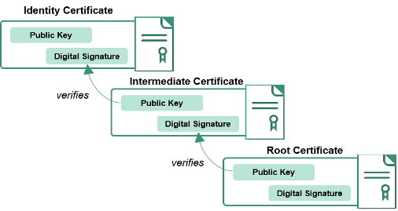

# Hierarchy of Certification authorities 

You may be familiar with the concept of bottleneck in information systems. An overloaded component in a system may severely limit the capacity of the system to process information and react to requests. Likely you wouldn't buy nowadays a single-core processor, instead you would go for a multi-core processor (like Intel Core i7) with two or more independent processing units called *cores*. Each core individually may be less powerful that a single-core processor, but in combination they overcome the bottleneck problem and allow for parallelism.

Well, millions of digital certificates are requested every day. 
Take a look to the picture below, which shows certificates issued by https://letsencrypt.org/ only. Relying on a few certification authorities, such as Comodo and VeriSign, would create an unnecessary and unwanted bottleneck. Hence the need of extending the trust we have on main certification authorities to other entities. 

<!---
(source: https://letsencrypt.org/stats/)
-->

Another drawback of having just a few certification authorities is reliability. Assume there exists just one certification authority on which we trust. If such a certification authority gets hacked, the whole world would be compromised, potentially leading to a catastrophe of unknown consequences. What in nature is known as *diversification*, is applied to certification authorities as well to reduce the risk of a single point of failure. 

## Chain of certificates

Of course, a solution to diversification of certification authorities cannot be blindly trust on everyone neither distribute our collection of certificates randomly. We can use a hierarchical structure, instead, which resembles the way governments and militaries are organised. Such a hierarchical structure works as follows:

* The main certification authorities are called *root certification authorities* as they remain in the top of the hierarchy. As we have seen and executed ourselves before, certificates of  root certification authorities are self-signed.
* Each root certification authority will have subordinate certification authorities. A subordinate certification authority,as everyone else, will need at least one valid certification to prove authenticity. And such a certificate is obtained and signed by the parent and root certification authority.
* Subordinate certification authorities can have their subordinate certification authorities, and so on.

The hierarchy of certification authorities then looks as follows. 

<!---
(source: https://docs.oracle.com/cd/E19424-01/820-4811/images/hier.gif)
-->

Having a hierarchy of certification authorities is nice and distribute the task of issuing certificates. But it complicates the task of verifying the authenticity of a certificate. For example, assume we receive a certificate signed by the "Engineering CA" as in the figure above, however, our system trust the certification authority "Root CA" only. Should our system trust certificates issued by "Engineering CA"? The answer is yes, because there exists a chain of trust whereby "Root CA" trusts on "USA CA" and "USA CA" trusts on "Engineering CA". 

Again, chain of trust is a fundamental principle in hierarchical structures, such as our society. But we ought to verify that the chain is correct. If someone comes to you and tells you- hey, I'm the minister of education - you are not going to believe that straight away. You would run your own verification process. The chain of trust in a hierarchy of certification authorities can be verified in a simple way. 

* All certificates issued by "Engineering CA" will contain a valid certificate from "USA CA", which is the parent certification authority. Thus, if a client does not trust "Engineering CA" it can still verify "USA CA" issued a valid certificate for "Engineering CA". 
* This process is repeated until the root of the hierarchy. For example, if the client does not trust "USA CA" either, then it can still verify "Root CA", because all certificates given to "USA CA" contain a valid certificate issued by "Root CA".

A graphical representation of this process is given next.

 
<!---
(source: https://piv.idmanagement.gov/img/certificatechain_small.png)
-->

## Your task

Your operating systems likely contain certificate signed by subordinate certification authorities. Find one of those and check the "Certification Path". This will give you the chain of trust of that certificate. 

In windows this can done by:

* going to "Manage Computer Certificates"
* going to "Intermediate Certification Authorities"
* choosing a certificate
* going to "Certification path"
