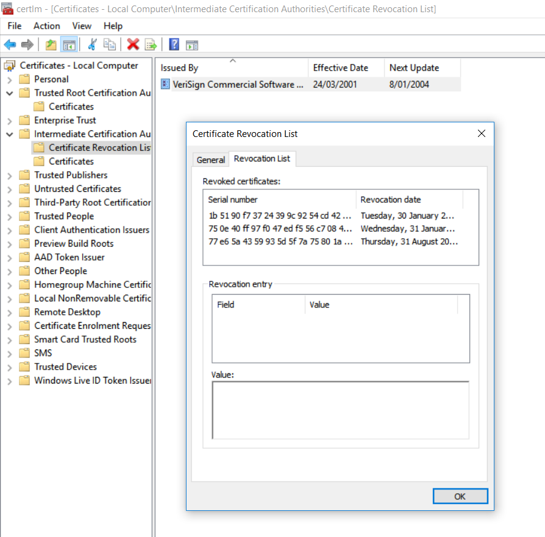

# Revoking digital certificates

Sometimes it turns out you shouldn't trust digital certificates after all.

A certification authority called *Trustico* announced in March 2018 that as many as $$23,000$$ certificates will be re-generated because their private keys were compromised. It is unclear how this happened. However, all companies ought to act quickly if they are know (or even suspect) that their private keys are no longer secret. 

The lesson we should learn from the _Trustico_ case is that, as security experts, we should be ready for the worst. And leaking a private key is close to being the worst that can happen to an organisation. Of course, public key infrastructure offers mechanisms to address the problem if keeys are compromised, which essentially consist of tossing out any certificate that relies on a compromised key. The process is known as *revocation*.

## Revocation 

When a certificated should no longer be used, then it is said to be "revoked". How does a client know what certificates have been revocated? By accessing to the *Certification Revocation List* (CRL). This list contains those certificates that are no longer valid. Certification authorities sign and publish those lists frequently, to keep their clients up-to-date. 

Note that, revocation is different from the validity period of a certificate. Clients should always verify the validity period of the certificates they used. Revocation is triggered when a certification authority no longer trusts a given certificate, because of a key compromise or the resignation of the certificate's owner. 

By looking at the figure below, you may notice that the revocation list does not contain the actual certificates, just their serial number. This is just a more efficient way to access and look for certificates. 

## Your task.

Imagine you are working for a large organisation.  One day you get an email from a middle manager, complaining that their default web browser is broken.  It keeps displaying warnings that a secure connection has failed and that they are using invalid security certificates.  

This, the email explains, is frustrating and lowers productivity.  The manager suggests that you make it your top priority to fix the problem. When you investigate a little further, you discover that many people have "fixed" the "problem" by switching to a browser that only displays an unobtrusive popup warning.

How should you reply to the manager?  What should you tell your colleagues?

