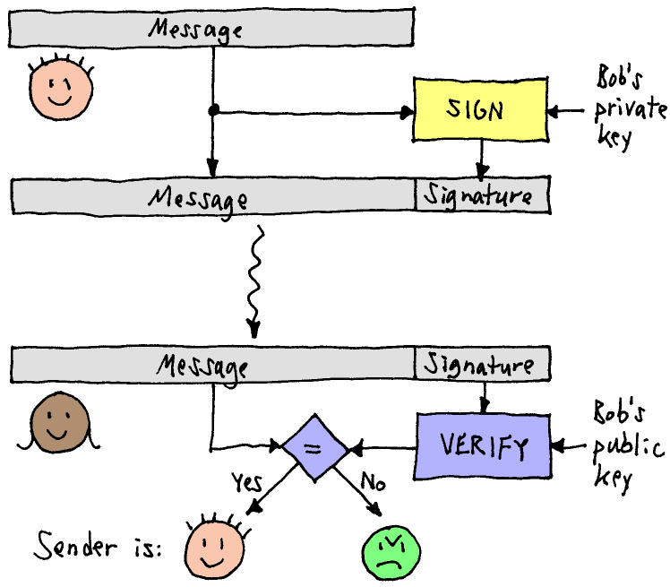
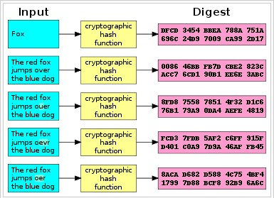
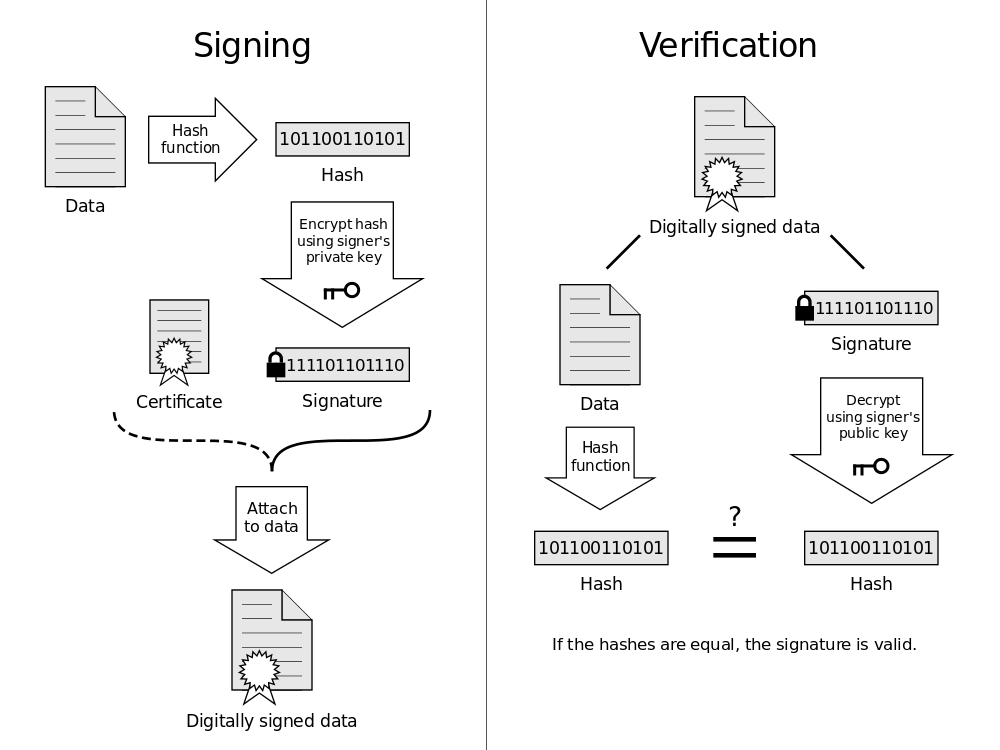

At this point we are able to sign a message $$m$$ using our own private key $sk$. In this step we will take a closer look at the other end: how can we securely verify the signature provided by a certification authority?

### Verification in theory - REVIEW

The theoretical verification process is simple. A message $$m$$ is signed with a private key $$sk$$, resulting in the signature $$m' = enc(m, sk)$$. Given a public key $$pk$$, if $$m = dec(m', pk)$$ then we can verify that $$m$$ was signed by the owner of the public key $$pk$$. This means that for the signature verification process to work, the signer needs to distribute both the original and signed message. An illustration of this process is given in the figure below: "Bob" acts as the signatory. 

<!--- (source: https://www.cs.rit.edu/~ark/lectures/https02/signedmessage1.png) -->

### Verification in practice - REVIEW

In practice, messages that need to be signed, like certificates or smart contracts, can be of arbitrary size. Because it is inefficient to encrypt large messages or files, signatures are usually applied over a *digest* of the message rather than on the message itself. In the same way we compress a file before sending it through email, digital signatures sign a *compressed* version of a message. 

In cryptography, such digest functions are called *cryptographic hash functions*. They take a message of arbitrary size and transform it into a message of fixed size. For example, the widely used hash function SHA-256 (Secure Hash Standard) on input a message $$m$$ outputs a message $$m'$$ of size $$256$$ bit. By signing $$m'$$ instead of $$m$$ we make the signing process more efficient, as usually the original message is much larger than $$256$$ bits. Here is an example of how a hash function works.

<!--- (source: https://cdn.comparitech.com/wp-content/uploads/2016/11/2016-11-04-15_15_12-Cryptographic-hash-function-Wikipedia.png) -->
The process of signing using hash functions is slightly different to the one shown above. It requires a message $$m$$ to be *hashed* first. Assuming that we are using the hash function SHA-256, we would obtain first SHA-256$$(m)$$. And then the signature will be created over SHA-256$$(m)$$ rather than $$m$$. That is, the signature of a message $$m$$ is the encryption of SHA-256$$(m)$$ with a private key $$sk$$. 

The verification process changes slightly as well, as illustrated in the figure below. The verifier will need to compute the hash of the message, and compare the obtained digest with the signature. 

<!--- (source: https://i.stack.imgur.com/eW9UY.png) -->

### Your task - REVIEW

Investigate the differences between compression functions and hash functions. 

### Further reading

https://en.wikipedia.org/wiki/Hash_function

