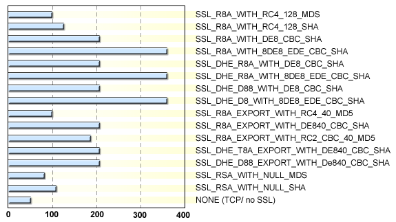
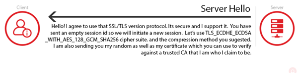
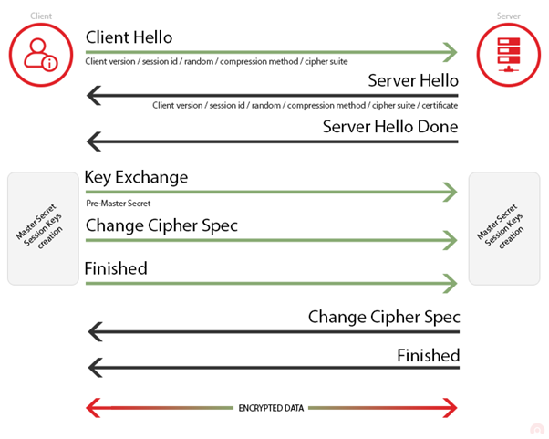

# Handshake protocol

For simplicity we have deliberately omitted not a few details in the protocols shown in previous steps, we are going to remedy this in this step. 

Something that you will encounter in your career in Information Technology  is the burden of dealing with different versions of software, protocols, ciphers, etc. If you ever travel to another country, chances are that you may face a number of different languages. So you will probably need to start your conversations with others by asking 'do you speak X?' X might be English, Spanish, Chinese, Hindi, etc. This is known in communication protocols as a *negotiation phase* or *handshake* in SSL/TLS. 

## Protocol parameters

During the negotiation phase, two participants reveal the type of protocols and parameters they support, until they agree on concrete communication parameters. In the case of the SSL/TLS protocol the main components a client and a server need to agree upon are: 

* the version of the protocol
* the supported cryptographic algorithms
* the key-exchange protocol to use

The first messages of the protocol are thus dedicated to the exchange of this information, which looks as follows.

In the "client hello" message the client provides:
+ Version of SSL/TLS supported
+ Cryptographic algorithms that can use
+ A nonce of 32-byte length (remember the previous step?)
+ The data compression methods supported by the client. Data compression methods are used for faster transfer speeds and have no security role, so we will ignore this field.
+ A session id, which is used to keep track of different executions of the same protocol

To get an idea of the number of cryptographic algorithms a client and server may choose from, look at the following picture. The codes on the left side of the figure represent combinations of [cryptographic primitives](https://en.wikipedia.org/wiki/Cryptographic_primitive), such as encryption/decryption functions, hash functions, and MACs. 

<!---
(source: https://www.ibm.com/support/knowledgecenter/en/ssw_i5_54/rzatz/51/sec/rzaiz599.gif)
-->

When the server gets the "client hello" message, the server chooses, amongst the options sent by the client, the SSL/TLS version, algorithms and parameters to be used for the remainder of the protocol. These options are sent within a "server hello" message, which also contains contains a digital certificate (you already know why they do that), and a nonce whose role was explained in the previous step.

It is worth remarking that the server will not blindly choose the parameters sent by the client. If the server believes that the security parameters are too weak or unsupported, then it will send a handshake failure message. 

As usual, the client verifies the server's digital certificate and send a key exchange message.

  

Both the client and the server send a "Change Cipher Spec" and "finished" message indicating that the handshake is complete.  The resulting protocol looks as follows.

## Your task

Well, you already have a pretty accurate idea of how the SSL/TLS protocol looks like. After looking at a number of man-in-the-middle attacks on protocols, can you tell if the SSL/TLS protocol can be broken by a man-in-the-middle attacker? 

If not, why not?  If so, how?

