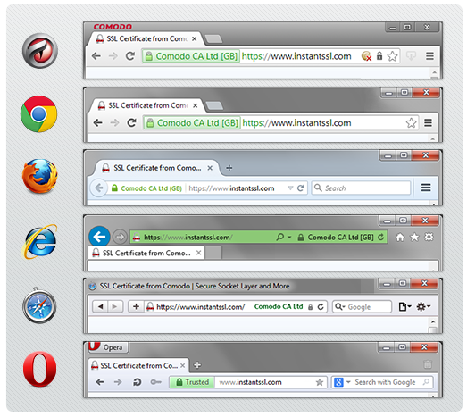

# HTTPS

An introduction to SSL/TLS couldn't finish without mentioning HTTPS; the most prominent instantiation of SSL/TLS. 

<!---
(source: https://www.instantssl.com/images/https-browsers.png)
-->

A few years back we were used to surfing the web over the HTTP protocol (Hypertext Transfer Protocol). This protocol has no build-in security so our traffic was wide open for attackers to read and modify. Back in 1994, Netscape Communications created HTTPS (Secure HTTP) for its Netscape Navigator web browser. Since then HTTPS has become the protocol of choice for clients and servers on the internet. Google for example, ranks HTTPS websites higher than HTTP websites.  This makes it more attractive for websites to switch to HTTPS despite of the obvious efficiency lost. As computer security experts, we must be happy that in 2018 HTTPS is used more often than the non-secure HTTP. 

You can easily recognise if your browser is using HTTPS by locking at the url and the small *lock* there in. The picture next depicts how HTTPS looks like in different browsers.

<!---
(source: https://www.instantssl.com/images/https-browsers.png)  
-->

** Rolando - those images are both the same and neither are linked up to Git.  I think the URL is for the second image.  What's the image for the first?**

## Your task 

Share with yours fellow learners those websites that you are currently using that are still over HTTP. For security reasons I'm going to ask you NOT to click on any of them. 