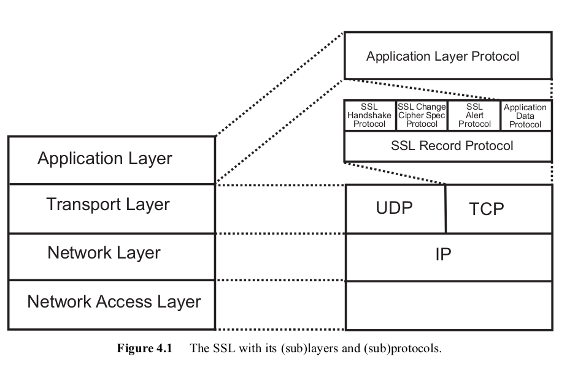

# Introduction to SSL/TLS

If you have been following this course carefully, you can be assure that you have the knowledge needed to understand the most important security protocol used nowadays to secure electronic services: the *SSL/TLS* protocol. We will dedicate the second half of this week to understand the fundamentals and underlying components of this protocol. 

## SSL/TLS: what for?

Electronic commerce, banking, business, are all commonplace today and have one feature in common: processes that before where executed via physical interaction are now executed remotely through a computer network, at any time and from every where. To do so, electronic services ought to mimic the same role that was performed before by, for example, bank employees. A bank employee would first verify the identity of the client, and right after  act as an intermediary between the client and the bank computer system. 

In electronic services the network is the intermediary. And we should admit that a computer network is faster than a human processing and transmitting information. Thus businesses become more cost-effective and efficient. But, who is going to check the identity of the clients? You probably already know the answer: a security protocol. 

During this week we are going to study the most important security protocol used to secure electronic services, the *SSL/TLS* family of security protocols. Most of the traffic 
for electronic commerce, electronic business, and electronic government, is currently being secured with SSL/TLS protocols. SSL/TLS is indeed responsible of the little lock in the corner of your web browser, which indicates that HTTP Secure (HTTPS) is being used.  Therefore, we find important to teach about the fundamental principles behind this family. 

Simply invoking SSL/TLS won't make your application more secure, in the same way that cryptography itself does not make communication stronger. It is necessary to understand the underlying components and features of the protocol, functional requirements, and security requirements as well. 

## The born of SSL

The first electronic purchases started in the early 1990s. Of course, people had reservation about the transmission of credit card information through the internet, as man-in-the-middle attackers can be silently eavesdropping the network traffic. Software developers at Netscape communication therefore prosecuted the goal of establishing a secure communication over an insecure network. Their idea was to introduce an intermediate layer between the transport layer and the application layer, named *the secure sockets layer (SSL)*. 

The first version of SSL was released in 1994. However it had a number of weaknesses. So it evolved in three versions - SSL 1.0, SSL 2.0, and SSL 3.0. The current version of SSL is called *TLS 1.0* (Transport Layer Security). The change of name is due to standarisation procedures, so TLS is typically referred as SSL/TLS. 

## Roadmap 

SSL/TLS seats in between the transport layer and application layer, allowing applications to use a secure connections on top of the existing network topology. Notice in the figure below that SSL/TLS consists of four main sub-protocols. 

1. *SSL handshake protocol:* allows the a client and server to identify each other and agree on the parameters for the connection, such encryption and decryption algorithms.  
2. *SSL Change Cipher protocol:* confirms the cipher suite to be used.
3. *SSL alert protocol:* signals problems with an SSL execution.
4. *Application data protocol:* takes data from the application using SSL and sends it through the established secure channel. 

<!---
(source: http://swrdfish.github.io/assets/ssl/ssl_stack.png)
-->

We will dedicate the remaining steps of this week to the study of those sub-protocols. 

## Your task

Discuss on the difference between UDP and TCP, and why SSL was originally designed over TCP only. 

