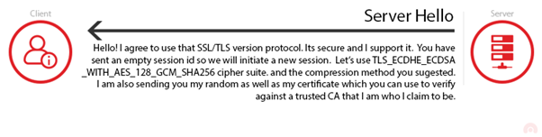

# Key exchange and handshake

As you may have discussed in the task of the previous step, browsers and computer programs have no need to use "passwords" in the way we (users) understand them. Instead, programs use a strong type of password known as *nonces*. As you already know, a nonce is just a large random number that is meant to be used once. The protocol depicted in the previous step can be easily adapted to use a nonce instead of a password as follows.

For the sake of exposition we have deliberately omitted not a few details in the protocol above. Something that you will encounter in your career in Information Technology often is the burden of dealing with different versions of software, protocols, ciphers, etc. For example, if you travel to another country chances are that you may face a different language. So you will probably start your communication with others asking: do you speak X? Where X can be English, Spanish, Chinese, Hindi, etc. This is known in communication protocols as a *negotiation phase* or *handshake*.

## Handshake

During the negotiation phase two participants reveal the type of protocols and parameters they support, until they agree on concrete communication parameters that will be used for emission and transmission. In the case of the SSL/TLS protocol they main components a client and a server need to agree upon are: 

* the version of the protocol
* the supported cryptographic algorithms
* the key-exchange protocol to use

The first messages of the protocol are thus dedicated to the exchange of this information, which looks as follows.

In the "client hello" message the client provides:
+ Version of SSL/TLS supported
+ Cryptographic algorithms that can use
+ A nonce of 32-byte length. We will explain the role of this random string later
+ The data compression methods supported by the client. Data compression methods are used for faster transfer speeds and have no security role, so we will ignore this field.
+ And a session id, which is used to keep track of different executions of the same protocol

Upon reception of the "client hello" message, the  server chooses, amongst the options sent by the client, the SSL/TLS version, algorithms and parameters to be used for the remainder of the protocol. These options are sent within a "server hello" message, which also contains contains a digital certificate for the purpose you already know, and a nonce whose role is going to be explained later.

It is worth remarking that the server will no blindly choose the parameters sent by the client. If the server believes that the security parameters are too weak or unsupported, then it will send a handshake failure message. 

As usual , the client verifies the server's digital certificate and send a key exchange message.

  

Both the client and the server send a "Change Cipher Spec" and "finished" message indicating that the  handshake is complete. The resulting protocol looks as follows.

## Your task

Discuss why you think the "finished" message is sent encrypted with the shared key. 
  

