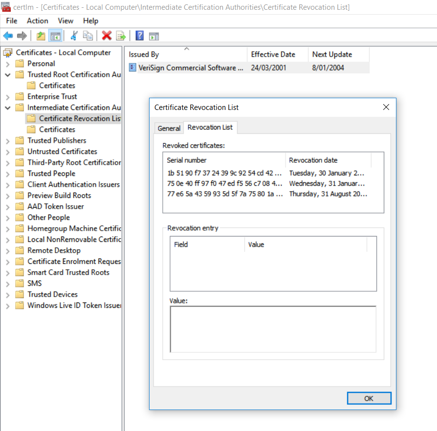

# Private key compromise

A certification authority called *Trustico* announced in March 2018 that as many as $23,000$ certificates will be re-generated because their private keys got compromised. It is unclear how those private keys were compromised. But companies ought to act quickly if they are certain or even suspect that their private keys are no longer secret. 

The lesson we should learn from the Trustico case is that, as security experts, we should be ready for the worst. And leaking a private key is close to be the worst that can happen to an organisation. Of course, public key infrastructure offers mechanisms to recover from key compromises, which essentially consists on tossing out any certificate that relies on a compromised key. This process is known as *revocation*.

## Revocation 

When a certificated should no longer be used, then it is said to be "revoked". How does a client know what certificates have been revocated? By accessing to the *Certification Revocation List* (CRL). This list contains those certificates that are no longer valid. Certification authorities sign and publish those lists frequently, to keep their clients up-to-date. 

Note that, revocation is different from the validity period of a certificate. Clients should always verify the validity period of the certificates they used. Revocation is triggered when a certification authority looses trust on a given certificate, because of a key compromise or the resignation of the certificate's owner. 

By looking at the figure below, you may notice that the revocation list does not contain the actual certificates, but their serial number. This is just a more efficient way to access and look for certificates. 

## Your task.

Investigate how frequent the certificate revocation list is updated in your operating system. 

