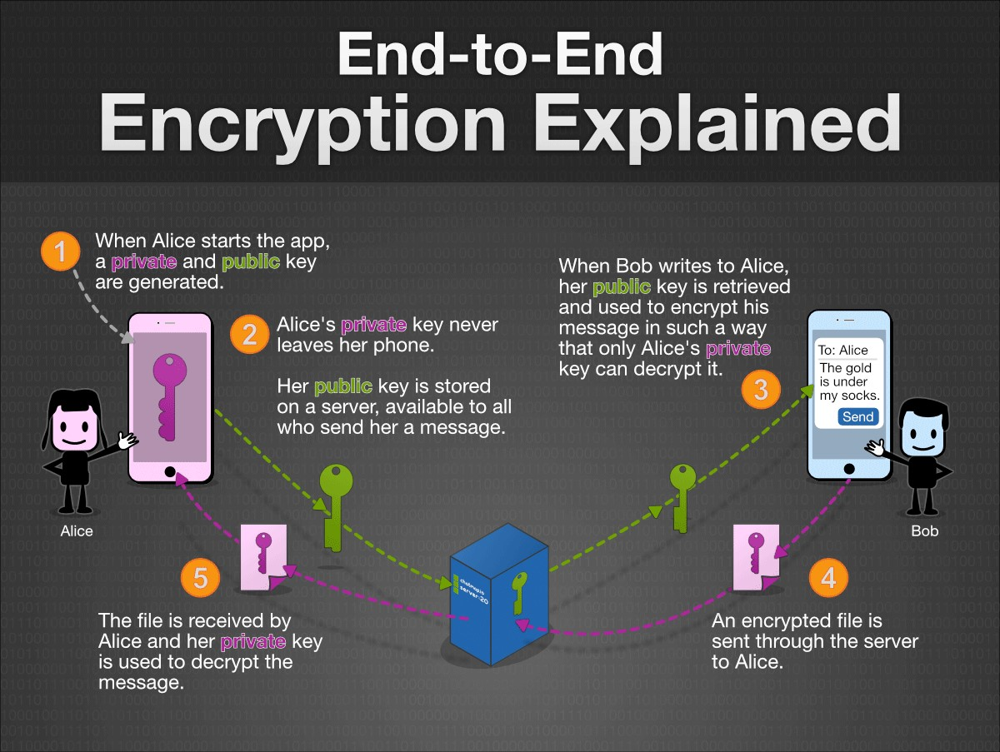

# End-to-end encryption

If you are still wondering what that yellow message in Whatsapp means, this step is for you.

Whatsapp is telling to their users that *end-to-end encryption* is being used. That is to say, your data is encrypted at your phone and can only be decrypted at the other end, i.e. the phone of the intended recipient. You ought to be already thoroughly familiar already with the concept of end-to-end encryption, because it equivalent to the goal of SSL/TLS. Hence it should be easy for you to understand how it works.

<!---
(source: http://www.chatmap.io/blog/img/end_to_end_encryption_infographic.png)
-->

WhatsApp started to use end-to-end encryption in 2016. The reasons are well-known, but it is also interesting to look at what they say in their FAQ webpage- "We completed the implementation of end-to-end encryption in 2016 for all messaging and calling on WhatsApp so that no one, not even us, has access to the content of your conversations." 

Yes, "not even us" is what makes end-to-end encryption so attractive. 

But, Whatsapp does collect a fair amount of metadata, especially information about your activity like how you use their services, how you interact, etc. Similarly to the phone call metadata collected by the NSA, Whatsapp doesn't not the content of your messages. Whatsapp does know quite a lot about you, though. 

## Signal

If you are wondering whether the collection of metadata is mandatory to provide a good user experience, it is not. The messenger *Signal* proves that privacy, security, and quality services can come together. 

Indeed, the end-to-end encryption protocol used in Whatsapp is the same that has been used in Signal since 2014, called, guess how, the *Signal protocol*. What makes Signal more privacy-friendly  than Whatsapp is that Signal only retains your phone number and the last time you logged into their server, yes, that's all. Not to mention that WhatsApp is owned by Facebook. 

Plus Signal is free and has its code is available on Github for you to check. Really free, no advertisers and no data monetisation. 

## Your task

I have two tasks for you this time. 

1. The first one is a fun and easy one. Check how much metadata Facebook collects and compare with the metadata collected by Signal.
2. The second one requires a deep understanding of security protocol analysis. Take a look at this scientific article [1] and explain whether you think that the Signal protocol is secure or not. 

[1] Katriel Cohn-Gordon, Cas J. F. Cremers, Benjamin Dowling, Luke Garratt, Douglas Stebila:
A Formal Security Analysis of the Signal Messaging Protocol. EuroS&P 2017: 451-466
