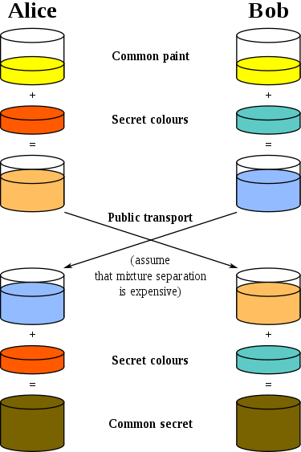

# Ephemeral key exchange

You know what a key exchange protocol is, we saw one last week and saw it again in the previous step. But such a key exchange protocol does not protect us if the certificate's secret key is compromised.

To protect against key compromise a protocol needs to:

1. Make sure that session keys are changed frequently.
2. Make sure that session keys cannot be derived with the use of the certificate's secret key.

You may notice that the key-exchange we have been using in this course does not satisfy the second property. 

## Diffie–Hellman key exchange

The key exchange mechanism that is mostly used nowadays to achieve the properties above is the * Diffie–Hellman key exchange*. The math is a little too heavy, but the principle can be understood through the following example from the Wikipedia.

> The process begins by having the two parties, Alice and Bob, agree on an arbitrary starting color that does not need to be kept secret (but should be different every time); in this example the color is yellow. Each of them selects a secret color that they keep to themselves. In this case, orange and blue-green. The crucial part of the process is that Alice and Bob now mix their secret color together with their mutually shared color, resulting in orange-tan and light-blue mixtures respectively, then publicly exchange the two mixed colors. Finally, each of the two mix together the color they received from the partner with their own private color. The result is a final color mixture yellow-brown that is identical to the partner's color mixture.

<!---
(source: https://upload.wikimedia.org/wikipedia/commons/thumb/4/46/Diffie-Hellman_Key_Exchange.svg/375px-Diffie-Hellman_Key_Exchange.svg.png)
-->

The trick in this protocol is that we assume that mixture separation is difficult. For example, assume the adversary compromises the secret key of the protocol, which is the yellow paint. By simple eavesdropping the adversary knows that Bob sent to Alice a light-blue paint. However, for the adversary is difficult to learn what was the color of the mixture used by Bob. What the adversary can do is to try different paint colors until a mix with the yellow paint results in exactly the same light-blue paint. But this is difficult. Well, what Diffie and Hellman did is to design a mathematical mechanism based on the hardness of the  discrete logarithm problem that achieves exactly that.

## Your task

Use OpenSSL to perform Diffie-Hellman key exchange. Follow the instructions here: https://sandilands.info/sgordon/diffie-hellman-secret-key-exchange-with-openssl