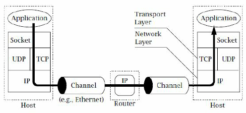

# Confidentiality vs Anonymity

Anonymity often refers to non-identifiability and untraceability. When an action cannot be attributed to a given person, then *non-identifiability* is satisfied. When several actions cannot be linked together as executed by a single person, then that person's actions are said to be *untraceable*. 

Go without saying that anonymity and confidentiality are different properties. In SSL/TLS for example, a digital certificate containing detailed information of at least one communicating party is required, otherwise a relation of trust cannot be established. Although SSL/TLS makes sure our communication remains secure and confidential, it does nothing about hiding the identities of the protocol participants. 

## TCP/IP 

If you still remember Week 2, TCP/IP is the protocol ruling our traffic through the internet. It was designed neither with security nor with anonymity as a feature. In order for packets to arrive at their destination and receivers to know the origin of the communication, IP packets contains the source and destination IP addresses in clear plain text. IP addresses are typically static. Hence they can be easily linked to the computer's owner or user. 

<!---
(source: https://www.researchgate.net/figure/A-TCP-IP-Connection_fig1_228728809)
-->

If you don't know it yet, every website you visit keeps record of the IP address of your computer along with additional information, such as date and time of the connection. This means that your connections are traceable and, very likely, identifiable as well. 

You may be thinking that a simple way to prevent a server from tracing your connections is to change your IP address often. And you are correct. However, doing so is not that easy. 

## Your task

Your task is to find out one mechanism to hide your IP address and explain how it works to your fellow learners. 

