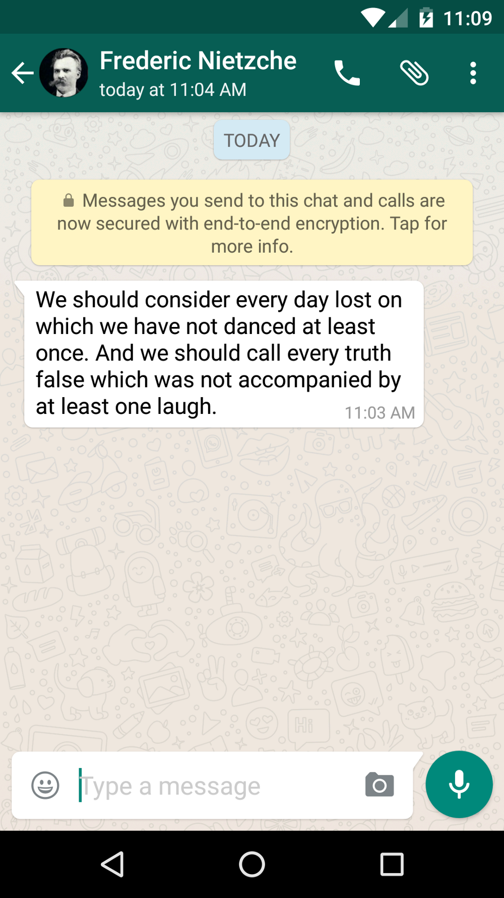

# Why metadata matters

It shouldn't come as a surprise that the National Security Agency at the Unite States, perhaps similar other agencies worldwide, conducts mass surveillance. News reports state that the NSA recorded millions of call metadata. What is a call metadata, you may wonder. 

Phone numbers involved in a call is considered metadata. So they know if you rang a suicide prevention hotline. Time and duration of a call is considered metadata. So they know if you regularly talk at off-hours. They also know if a gynecologist called you, spend half an hour with you, and later you called the suicide prevention hotline.

President Barack Obama said that - "When it comes to telephone calls, nobody is listening to your telephone calls." Instead, they are just recording the so-called *metadata*. But, as we have seen. Metadata is just good enough to invade people's privacy and learn sensitive information.

## How can we protect our metadata

The simple answer is by using software that protects you metadata. But that's hard, with the exception, perhaps, of messaging applications where Signal standouts as the first large-scale private messenger application.

## Your task

Share a screenshot of a non-confidential, non-sensitive, non-private, etc. Whatsapp message. What does it mean the message in yellow? 

A message should look as follows.

<!---
(source: https://cdn-images-1.medium.com/max/1000/1*IU7Pi7tN74OI8CbumVZaWg.png)
-->

