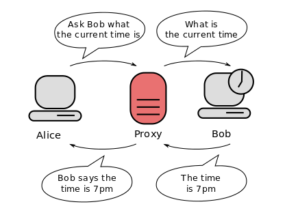

# Proxies

Haven't you ever wanted to give a letter to someone but were too ashamed to do it in person? Well, a solution that kids often find is giving the message to a friend, and asking the friend to deliver the message to the intended recipient. 
In terms used by the computer community, that friend has acted as a *proxy*.

According to Wikipedia- *In computer networks, a proxy server is a server (a computer system or an application) that acts as an intermediary for requests from clients seeking resources from other servers. A client connects to the proxy server, requesting some service, such as a file, connection, web page, or other resource available from a different server and the proxy server evaluates the request as a way to simplify and control its complexity.*

Sometimes pictures are better than words, so take a look at the following illustration . 

<!---
(source: https://en.wikipedia.org/wiki/File:Proxy_concept_en.svg)
-->

It is easy to find web proxies (paid or free) on the internet. Your company may very well has their proxies as well. As you learned in Week 2, this allows several devices to get internet connectivity through the same internet IP address. 

Something we have repeated an endless number of times in this course is that we should not make trust assumptions where there is no evidence of trust. You may trust on a certification authority, you may trust on the proxies setup by your company, but you should be careful and suspicious with third-party proxies. 

What if the proxy you use is dishonest? Essentially you loose all the anonymity you are aiming for. Yes, the server is not able to trace you, unless it gets in cooperation with the dishonest server. But it is not clear why we should trade anonymity lost from a server to a dishonest proxy. 

## Your task

Find out why people use web browser proxies and share your findings with your fellow learners. 