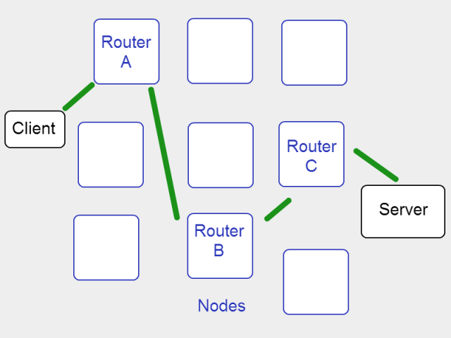

# Tor

Tor is software that allows users to browse the Web anonymously. It is being developed by a nonprofit organization, whose website is at: https://www.torproject.org/. As you may expect, the underlying principle behind Tor is the onion routing technique. 

## How does Tor work?

The Tor network is composed of "computer nodes" that 
join voluntarily the network. The idea is that, when a Tor user likes to visit a website, his traffic is going to travel a bit first through the Tor network before arriving to webserver. In a sense, the Tor network is acting as a proxy. 

<!---
(source: https://www.digitaltrends.com/computing/a-beginners-guide-to-tor-how-to-navigate-through-the-underground-internet/)
-->

Proxing is, of course, not the main feature of Tor. Tor is very good at hiding the destination IP address from intermediate nodes. For example, in the figure above "Router A", "Router B", and "Router C" are all intermediate nodes within the Tor network relaying the traffic between the client and the server. Tor ensures that, for example, Router A cannot tell what server the client wants to communicate with. And Tor achieves that by using onion encryption. 

1. The client encrypts the message $m$ it wants to send to the server with the public key of the server $sk_S$, resulting in $\{m\}_{sk_S}$. This ensures confidentiality of $m$; no one, but the server, can decrypt $\{m\}_{sk_S}$.
2. The client decides that Router C will provide the encrypted message $\{m\}_{sk_S}$ to the server. To that effect, the client should tell Router C that the message is intended to the server and, of course, give to Router C the message to be deliver. That is, the client gives $\{C \rightarrow Server, \{m\}_{sk_S}\}_{pk_C}$ to Router C. 
3. The client decides that Router B will provide the encrypted message $\{C \rightarrow Server, \{m\}_{sk_S}\}_{pk_C}$ to Router C, so this gets encrypted with the public key of Router B, resulting in $\{B \rightarrow C, \{C \rightarrow server, \{m\}_{sk_S}\}_{pk_C}\}_{pk_B}$.
4. Finally, the client decides that Router A will provide the encrypted message $\{B \rightarrow C, \{C \rightarrow server, \{m\}_{sk_S}\}_{pk_C}\}_{pk_B}$ to Router B, so this gets encrypted with the public key of Router A, resulting in $\{A \rightarrow B, \{B \rightarrow C, \{C \rightarrow server, \{m\}_{sk_S}\}_{pk_C}\}_{pk_B}\}_{pk_A}$.

I'm sure you already got the idea. The technique of onion encryption allows you to add layer over layer of encryption. Because different encryptions keys are used in every layer, only the authorised party can decrypt the message and decide how the message should be routed. Let's see how such a routing works. 

1. Once Router A receives the message $\{A \rightarrow B, \{B \rightarrow C, \{C \rightarrow server, \{m\}_{sk_S}\}_{pk_C}\}_{pk_B}\}_{pk_A}$ from the client, Router A decrypts the message an obtain $A \rightarrow B, \{B \rightarrow C, \{C \rightarrow server, \{m\}_{sk_S}\}_{pk_C}\}_{pk_B}$. At this point Router A knows that the client wants to forward this message to Router B. However, Router A cannot figure out how the message is going to be routed right after Router B. That means that the actual destination of the message is invisible to the eyes of Router A. That's exactly how anonymity is achieved. 
2. The process continues. Once Router B receives the message $\{B \rightarrow C, \{C \rightarrow server, \{m\}_{sk_S}\}_{pk_C}\}_{pk_B}\}$ from Router A, Router B decrypts the message an obtain $B \rightarrow C, \{C \rightarrow server, \{m\}_{sk_S}\}_{pk_C}\}$. So Router B sends $\{C \rightarrow server, \{m\}_{sk_S}\}_{pk_C}\}$ to Router C. 
3. Router C decrypts the received message, and sends $\{m\}_{sk_S}$ to the server. 
4. Finally, the server retrieves the message $m$ by decrypting with its public key. 

## Your task

There is large debate on whether Tor should or not be used. Please join the debate and discuss how Tor can be used for good and bad. 