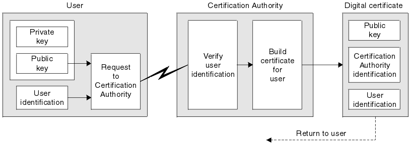

# Generation of digital certificates

It becomes apparent from our discussion in the previous step that we shouldn't trust on the public key or certificate of any communication partner unless we have already established a secure channel or a trusted third party is used to attest the legitimacy of the digital certificate. 

A trusted third party entity in charge of issuing digital certificates is called a *certification authority*. As this course advances you will notice that certification authorities play a prominent role in how critical applications, such as electronic commerce, secure e-mail and virtual private networks, operate on the Internet. Millions of certificates are issued every year by a few certification authorities worldwide, which are used to enable secure communication and protect billions of transactions.

In this step we are going to look at how certification authorities generate digital certificates.

# Content of a digital certificate

A digital certificate typically contains the following information:

* Owner's public key 
* Owner's identifying information
* Certification authority identification

The process (illustrated in the figure below) of obtaining a valid certificate requires the user to generate its own pair of public key and secret key. The user then contact a certification authority to request a valid certificate binding the user's identity with the generated public key. Recall that the private key should not be distributed, not even to a trustworthy certification authority. The certification authority will then verify the user's identity and approve the generation of a certificate. 

<!--- (source: https://sites.google.com/site/ddmwsst/_/rsrc/1472874337832/digital-certificates/obtain-cert.gif) -->

A digital certificate to be valid must satisfy the following security requirements:

1. *Identification:* a proper mechanism of identification should be in place to make sure that the owner's data and public key is correct. Note that, a user requesting a digital certificate may be a person, organisation, web entity or software application. 
2. *Integrity:* an assurance that a certificate has not been altered (intentionally or not) must be provided. 
3. *Authenticity:* a proof that a digital certificate has been issued by a given certification authority should be given.

Certification authorities have different means to identify the owner of a certificate. Depending on the type of the entity requesting a certificate, a certification authority would lunch a verification process or other. These processes are normally administrative and do not depend on cryptography. Thus we are not going to discuss them in this unit. Integrity and authenticity will be covered in the next steps, though.

## Your task

Discuss how you think university degrees satisfy the three security requirements stated above, namely identification, integrity, and authenticity. 

